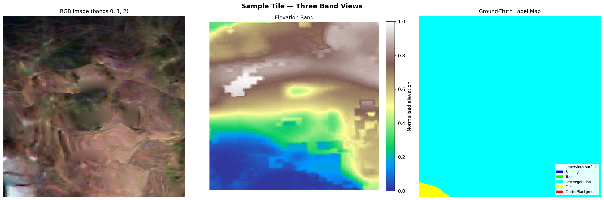
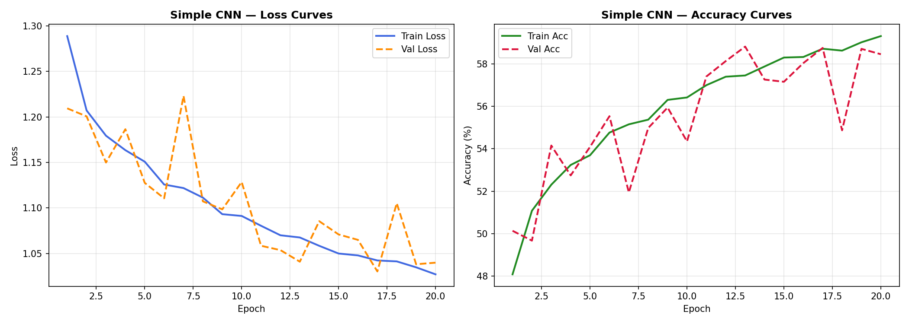
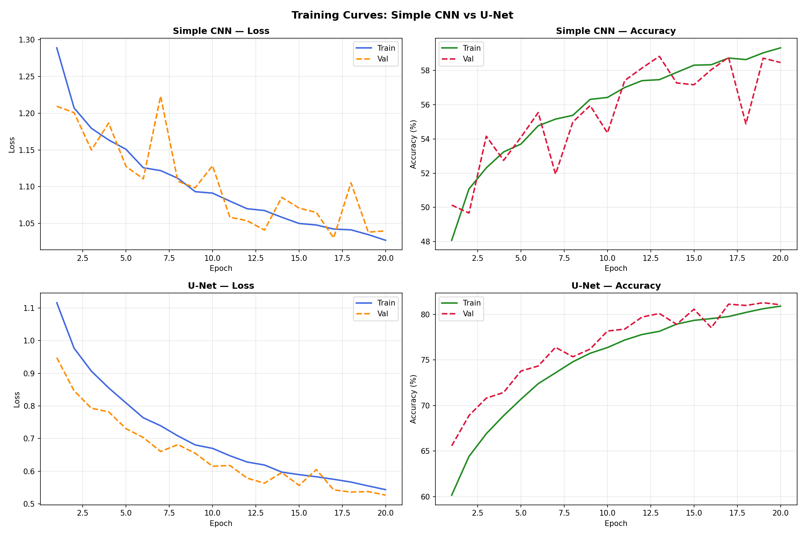
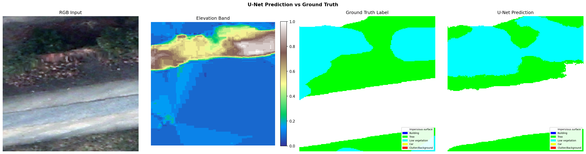

# 🛰️ Semantic Segmentation with Deep Learning
## Complete Detailed Tutorial — Potsdam Dataset

---

**Who is this for?**
This notebook is written for someone who:
- Knows basic Python (loops, functions, lists)
- Wants to learn **computer vision AI** in practice
- Wants to **understand, see, and execute** at the same time

**By the end of this notebook you will understand:**
- How satellite/aerial datasets work
- How a neural network labels an image pixel-by-pixel
- What a simple CNN architecture is and how it works
- What U-Net is and why it outperforms a plain CNN

---
> **💡 How to use:** Read each Markdown cell, then run the code cell below it (▶ button).
> Never skip a step — each cell builds on the previous one!


---
## 📚 Concept 1: What is Semantic Segmentation?

### The story starts here...

Imagine a drone took an aerial photo of a city. We want to know:
**What does every pixel of this image belong to?** A building? A tree? A car? A road?

This task is called **Semantic Segmentation**.

### Difference from Object Detection:
- **Object Detection**: draws a bounding box around an object → "there is a car here"
- **Semantic Segmentation**: for **every pixel** says → "this pixel is a car, that pixel is a tree"

```
Input: Aerial image              Output: Color-coded map
┌─────────────────┐               ┌─────────────────┐
│  (RGB image)    │  → AI model→  │  Yellow = Car   │
│                 │               │  Green  = Tree  │
│                 │               │  Blue   = Bldg  │
└─────────────────┘               └─────────────────┘
```

### Why does it matter?
- 🚗 Self-driving cars (each pixel → road/sidewalk/car)
- 🏥 Medical imaging (each pixel → tumor/healthy tissue)
- 🛰️ Urban mapping (buildings, roads, green areas)


---
## 📦 Concept 2: The Potsdam Dataset

### Why Potsdam?

**Potsdam** is a city in Germany. The ISPRS organization captured aerial images at
**5 cm resolution** (1 pixel = 5×5 cm on the ground) and **manually labeled every single
pixel**. This took years of work and produced an extremely valuable benchmark dataset.

### GeoTIFF Format

GeoTIFF is a **multi-band image** format. Like a colour photo with 3 layers (RGB),
but with **6 layers (bands)**:

```
┌─────────────────────────────────────────────────────┐
│  Band 0: Red                → standard red channel  │
│  Band 1: Green              → standard green channel │
│  Band 2: Blue               → standard blue channel  │
│  Band 3: Infrared (IR)      → invisible to human eye │
│  Band 4: Elevation (DSM)    → height above sea level │
│  Band 5: Labels             → ← THIS is our target! │
└─────────────────────────────────────────────────────┘
```

### 6 Label Classes:
| ID | Class Name | Display Color |
|---|---|---|
| 0 | Impervious surface (asphalt, pavement) | ⬜ White |
| 1 | Building | 🟦 Blue |
| 2 | Tree | 🟩 Green |
| 3 | Low vegetation (grass, shrubs) | 🩵 Cyan |
| 4 | Car | 🟨 Yellow |
| 5 | Clutter / Background | 🟥 Red |

> **Why Infrared?** Plants strongly reflect infrared light.
> This band makes it much easier to separate trees from asphalt.


---
## 📦 Step 0 — Install Libraries

### What does each library do?

- **`rasterio`**: reads GeoTIFF files (like PIL, but for geospatial multi-band images)
- **`numpy`**: multidimensional numerical arrays (every image = a numpy array)
- **`matplotlib`**: plotting and image display
- **`scikit-learn`**: ML utilities including KFold splitter
- **`tensorflow`**: the deep learning framework — building and training neural networks

> ⏳ This may take a couple of minutes. `Successfully installed` → you're good.


```python
# Install required libraries for Kaggle (rasterio is often missing)
!pip install rasterio -q

import tensorflow as tf
print('TensorFlow installed, version:', tf.__version__)
print('All dependencies ready!')
```

    2026-02-22 13:32:38.218037: E external/local_xla/xla/stream_executor/cuda/cuda_fft.cc:467] Unable to register cuFFT factory: Attempting to register factory for plugin cuFFT when one has already been registered
    WARNING: All log messages before absl::InitializeLog() is called are written to STDERR
    E0000 00:00:1771767158.406433      24 cuda_dnn.cc:8579] Unable to register cuDNN factory: Attempting to register factory for plugin cuDNN when one has already been registered
    E0000 00:00:1771767158.461951      24 cuda_blas.cc:1407] Unable to register cuBLAS factory: Attempting to register factory for plugin cuBLAS when one has already been registered
    W0000 00:00:1771767158.904643      24 computation_placer.cc:177] computation placer already registered. Please check linkage and avoid linking the same target more than once.
    W0000 00:00:1771767158.904691      24 computation_placer.cc:177] computation placer already registered. Please check linkage and avoid linking the same target more than once.
    W0000 00:00:1771767158.904694      24 computation_placer.cc:177] computation placer already registered. Please check linkage and avoid linking the same target more than once.
    W0000 00:00:1771767158.904696      24 computation_placer.cc:177] computation placer already registered. Please check linkage and avoid linking the same target more than once.
    

    TensorFlow installed, version: 2.19.0
    All dependencies ready!
    

---
## ⚙️ Step 1 — Imports and Configuration

### What does this cell do?

We import everything the whole notebook needs in one place.

**Key imports explained:**
```python
import os           # file-system operations (os.path.join, os.walk)
import random       # random selection (random.choice, random.seed)
import json         # save/load JSON files (fold splits, results)
import numpy as np  # array math — 'np' is the conventional alias
import matplotlib.pyplot as plt  # plotting and image display
import rasterio     # read GeoTIFF files
import tensorflow as tf          # deep learning
from tensorflow import keras     # high-level TensorFlow API
from tensorflow.keras import layers  # layer building blocks
```

### What is SEED?
`SEED = 42` makes all random operations reproducible.
Same seed → same results every run. The number 42 is just a convention!

### What is DATA_DIR?
The folder path where the `.tif` tile files live.
⚠️ If you downloaded the full dataset elsewhere, change this path.


```python
import os, random, json
import numpy as np
print('Basic imports loaded ✓')
```

    Basic imports loaded ✓
    


```python
import matplotlib
matplotlib.use('Agg')  # headless mode
import matplotlib.pyplot as plt
import matplotlib.patches as mpatches
print('Matplotlib loaded ✓')
```

    Matplotlib loaded ✓
    


```python
import rasterio
print('Rasterio loaded ✓')
```

    Rasterio loaded ✓
    


```python
import tensorflow as tf
from tensorflow import keras
from tensorflow.keras import layers
from tensorflow.keras.callbacks import ModelCheckpoint
print(f'TensorFlow {tf.__version__} loaded ✓')
```

    TensorFlow 2.19.0 loaded ✓
    


```python
from sklearn.model_selection import KFold
from IPython.display import Image, display
print('All imports ready ✓')
```

    All imports ready ✓
    


```python

```


```python
# ── Reproducibility seed ────────────────────
SEED = 42
random.seed(SEED)
np.random.seed(SEED)
tf.random.set_seed(SEED)

# ── Global settings ────────────────────────
N_FOLDS     = 5
NUM_CLASSES = 6

CLASS_NAMES = [
    'Impervious surface', 'Building', 'Tree',
    'Low vegetation', 'Car', 'Clutter/Background'
]
CLASS_COLORS = [
    [255, 255, 255],  # white  – Impervious surface
    [0,   0,   255],  # blue   – Building
    [0,   255,   0],  # green  – Tree
    [0,   255, 255],  # cyan   – Low vegetation
    [255, 255,   0],  # yellow – Car
    [255,   0,   0],  # red    – Clutter / Background
]

def discover_data_dir():
    """Auto-locate the folder containing .tif files, prioritizing Kaggle paths."""
    # Standard Kaggle input path
    kaggle_input = '/kaggle/input/datasets/minatahmasebi/postdam/Potsdam-GeoTif'
    if os.path.exists(kaggle_input):
        # Check if the .tif files are directly here or in a subfolder
        for root, _, files in os.walk(kaggle_input):
            if any(f.endswith('.tif') for f in files):
                return root
    
    candidates = []
    cwd = os.getcwd()
    search_bases = [cwd]
    search_bases.append(os.path.dirname(cwd))
    search_bases.append(os.path.join(cwd, 'PROJECT'))
    search_bases.append(os.path.join(os.path.dirname(cwd), 'PROJECT'))
    for base in search_bases:
        candidates.append(os.path.join(base, 'Potsdam-GeoTif', 'Potsdam-GeoTif'))
        candidates.append(os.path.join(base, 'Potsdam-GeoTif'))
        candidates.append(os.path.join(base, 'data'))
    for p in candidates:
        if os.path.isdir(p):
            try:
                if any(f.endswith('.tif') for f in os.listdir(p)):
                    return p
            except:
                continue
    search_root = os.path.dirname(os.path.dirname(cwd))
    for root, _, files in os.walk(search_root):
        if any(f.endswith('.tif') for f in files):
            return root
    return 'data'

DATA_DIR = discover_data_dir()
OUTPUT_DIR = '/kaggle/working' if os.path.exists('/kaggle/working') else '.'
print(f'Data directory: {DATA_DIR}')
print(f'Output directory for logs and models: {OUTPUT_DIR}')

```

    Data directory: /kaggle/input/datasets/minatahmasebi/postdam/Potsdam-GeoTif
    Output directory for logs and models: /kaggle/working
    

---
# ━━━━━━━━━━━━━━━━━━━━━━━━━━━━━━
# Step 1: Dataset Preparation
# ━━━━━━━━━━━━━━━━━━━━━━━━━━━━━━

## Goal of this step:
1. Find all tile files in the dataset directory
2. Read one tile and visualise its different bands
3. Split the files into 5 groups (folds) for fair evaluation

## Why is this step important?

Before building any AI model, we must **understand our data**.
Deep learning without data understanding is like cooking without looking at the ingredients!


### 1.1 — Finding GeoTIFF Files

#### What does `get_all_tif_files` do?

```python
os.walk(data_dir)
```
Recursively visits every folder and sub-folder — like opening every directory one by one and
listing its files.

```python
if f.endswith('.tif')
```
Selects only files whose extension is `.tif`.

```python
tif_files.append(os.path.join(root, f))
```
Builds the **full path** (folder + filename) and appends it to our list.

> With the full Potsdam dataset: expect 15,000+ files.
> Right now we work with one sample tile — results are illustrative.


```python
def get_all_tif_files(data_dir):
    """
    Recursively finds all .tif files inside data_dir.

    Args:
        data_dir (str): root folder to search
    Returns:
        list[str]: full paths to every .tif file found
    """
    tif_files = []  # start with an empty list

    # os.walk yields (current_folder, sub-folders, files)
    for root, dirs, files in os.walk(data_dir):
        for f in files:
            if f.endswith('.tif'):               # only GeoTIFF files
                full_path = os.path.join(root, f)  # build full path
                tif_files.append(full_path)

    return tif_files

all_files = get_all_tif_files(DATA_DIR)
all_files = all_files[:15000]  # Kaggle performance limit

print(f'GeoTIFF files found: {len(all_files)}')
print('Files:')
for f in all_files[:10]:          # show at most 10
    print('  •', os.path.basename(f))

```

    GeoTIFF files found: 15000
    Files:
      • 0000036064-0000010080.tif
      • 0000024416-0000021952.tif
      • 0000025312-0000013664.tif
      • 0000026656-0000038976.tif
      • 0000033824-0000034048.tif
      • 0000032032-0000036288.tif
      • 0000028000-0000002464.tif
      • 0000010080-0000033600.tif
      • 0000002240-0000036288.tif
      • 0000001120-0000036512.tif
    

### 1.2 — Reading and Understanding a Tile

#### `rasterio.open`

`rasterio` is like `PIL.Image.open` but for geospatial multi-band images.

```python
with rasterio.open(file_path) as src:
    data = src.read()  # reads ALL bands → numpy array of shape (6, H, W)
```

The data shape `(6, 224, 224)` means:
- **6**: number of bands
- **224**: image height in pixels
- **224**: image width in pixels

#### Why `normalize_band`?

Elevation values might range from 100 to 500 metres.
`matplotlib` expects float images in the range **0 – 1**.
Normalisation maps any range to [0, 1]:

```
normalised = (value − min) / (max − min)
Example: (300 − 100) / (500 − 100) = 0.5
```

#### Why `label_to_rgb`?

The label band contains integers 0–5 (one per class).
For display, we map each integer to a colour:
- 0 → white, 1 → blue, 2 → green, …


```python
# ── Helper functions ────────────────────────────────────────────────

def normalize_band(band):
    """
    Normalises a 2D array to the range [0.0, 1.0].

    Formula: normalised = (x - min) / (max - min)

    Why: matplotlib float images must be in [0, 1].
    Edge case: if all values are identical, return zeros (avoid /0).
    """
    b_min, b_max = band.min(), band.max()
    if b_max == b_min:
        return np.zeros_like(band, dtype=np.float32)
    return (band - b_min).astype(np.float32) / (b_max - b_min)


def label_to_rgb(label_band, colors):
    """
    Converts an integer label map (H, W) to an RGB image (H, W, 3).

    Each unique integer gets painted with the corresponding colour.

    Args:
        label_band : 2D numpy array of class IDs (integers 0-5)
        colors     : list of [R, G, B] colour triplets
    Returns:
        rgb : uint8 array of shape (H, W, 3)
    """
    h, w = label_band.shape
    rgb  = np.zeros((h, w, 3), dtype=np.uint8)  # start: black image

    for class_idx, color in enumerate(colors):
        mask       = (label_band == class_idx)  # boolean mask for this class
        rgb[mask]  = color                       # paint all those pixels

    return rgb


# ── Select a sample tile ─────────────────────────────────────────────
EXCLUDED   = '0000000224-0000042784.tif'   # example tile from the assignment
candidates = [f for f in all_files if EXCLUDED not in f]
sample_file = random.choice(candidates) if candidates else all_files[0]
print('Selected tile:', os.path.basename(sample_file))

# ── Read the tile ────────────────────────────────────────────────────
with rasterio.open(sample_file) as src:
    data      = src.read()       # shape: (6, H, W)
    crs       = src.crs
    transform = src.transform

print(f'\nData shape : {data.shape}  →  {data.shape[0]} bands | {data.shape[1]}×{data.shape[2]} px')
print(f'CRS        : {crs}')
print(f'\nBand value ranges:')
for i, name in enumerate(['Red','Green','Blue','Infrared','Elevation','Labels']):
    print(f'  Band {i} ({name:<12}): {data[i].min():6} → {data[i].max():6}')

```

    Selected tile: 0000033600-0000011872.tif
    
    Data shape : (6, 224, 224)  →  6 bands | 224×224 px
    CRS        : EPSG:4326
    
    Band value ranges:
      Band 0 (Red         ):   19.0 →  120.0
      Band 1 (Green       ):   27.0 →  141.0
      Band 2 (Blue        ):   16.0 →  144.0
      Band 3 (Infrared    ):   19.0 →  184.0
      Band 4 (Elevation   ):    8.0 →  194.0
      Band 5 (Labels      ):    2.0 →    4.0
    

### 1.3 — Visualising Three Views

#### Why three views?
- **RGB image**: what the human eye sees
- **Elevation band**: buildings are taller than the ground — clearly visible
- **Label map**: what our model must learn to predict

#### `np.stack`
Stacks three 2D arrays into one 3D array:
```python
stack([R(224,224), G(224,224), B(224,224)], axis=-1) → (224, 224, 3)
```

#### `plt.subplots(1, 3)`
Creates a figure with **1 row** and **3 columns** — three plots side by side.

#### `plt.colorbar`
Colour bar beside the elevation plot: brighter colour = higher elevation.

#### `mpatches.Patch`
Creates coloured legend keys (one per class) so we know what each colour means.


```python
# ── Build display images ─────────────────────────────────────────────

red   = data[0].astype(np.float32)
green = data[1].astype(np.float32)
blue  = data[2].astype(np.float32)
elev  = data[4].astype(np.float32)
label = data[5].astype(np.int32)

# RGB: stack three normalised bands along the last axis
rgb_img = np.stack([
    normalize_band(red),
    normalize_band(green),
    normalize_band(blue),
], axis=-1)                    # result: (H, W, 3)

elev_norm = normalize_band(elev)           # (H, W)
label_rgb = label_to_rgb(label, CLASS_COLORS)  # (H, W, 3)

# Legend patches
patches = [
    mpatches.Patch(color=[c/255 for c in CLASS_COLORS[i]], label=CLASS_NAMES[i])
    for i in range(NUM_CLASSES)
]

# ── Plot ─────────────────────────────────────────────────────────────
fig, axes = plt.subplots(1, 3, figsize=(18, 6))
fig.suptitle('Sample Tile — Three Band Views', fontsize=14, fontweight='bold')

axes[0].imshow(rgb_img)
axes[0].set_title('RGB Image (bands 0, 1, 2)', fontsize=11)
axes[0].axis('off')

im = axes[1].imshow(elev_norm, cmap='terrain')
axes[1].set_title('Elevation Band', fontsize=11)
axes[1].axis('off')
plt.colorbar(im, ax=axes[1], fraction=0.046, pad=0.04, label='Normalised elevation')

axes[2].imshow(label_rgb)
axes[2].set_title('Ground-Truth Label Map', fontsize=11)
axes[2].axis('off')
axes[2].legend(handles=patches, loc='lower right', fontsize=7, framealpha=0.9)

plt.tight_layout()
vis_path = os.path.join(OUTPUT_DIR, 'step1_visualization.png')
plt.savefig(vis_path, dpi=150, bbox_inches='tight')
plt.close()
display(Image(vis_path))
print('Saved:', vis_path)

```


    

    


    Saved: /kaggle/working/step1_visualization.png
    

### 1.4 — Class Distribution Statistics

#### Why check class distribution?

Suppose 90% of pixels are 'Impervious surface' and 1% are 'Car'.
A model that always predicts 'Impervious surface' has 90% accuracy — but is **useless**!

Checking distribution tells us:
- Whether the dataset is **class-balanced**
- Which classes will be easier/harder to learn
- Whether we need class-weighted loss later

#### How it works:
```python
(label == i).sum()   →  boolean mask → count of True values = pixel count for class i
count / total * 100  →  percentage
```


```python
total_pixels = label.size  # H × W
print('Class distribution in sample tile:')
print(f'{"Class":<30} {"Pixels":>12} {"Percent":>9}  Bar')
print('=' * 68)

for i, name in enumerate(CLASS_NAMES):
    count   = (label == i).sum()
    pct     = 100 * count / total_pixels
    bar     = '|' + '█' * int(pct / 2)
    print(f'{name:<30} {count:>12,} {pct:>8.2f}%  {bar}')

print('=' * 68)
print(f'Total: {total_pixels:,} pixels  ({data.shape[1]} × {data.shape[2]})')

dominant = max(range(NUM_CLASSES), key=lambda i: (label==i).sum())
print(f'\nDominant class: "{CLASS_NAMES[dominant]}" at {100*(label==dominant).sum()/total_pixels:.1f}%')

```

    Class distribution in sample tile:
    Class                                Pixels   Percent  Bar
    ====================================================================
    Impervious surface                        0     0.00%  |
    Building                                  0     0.00%  |
    Tree                                      1     0.00%  |
    Low vegetation                       49,740    99.13%  |█████████████████████████████████████████████████
    Car                                     435     0.87%  |
    Clutter/Background                        0     0.00%  |
    ====================================================================
    Total: 50,176 pixels  (224 × 224)
    
    Dominant class: "Low vegetation" at 99.1%
    

### 1.5 — K-Fold Cross-Validation Split

#### The evaluation problem

If we evaluate on the **same data we trained on**, it's like giving a student the exam
questions the night before. The score looks great but means nothing.

#### Solution: K-Fold Cross-Validation

Split all data into **K equal groups (folds)**:

```
All files: ████████████████████ (100 files)
            ├─ Fold 1 ─┤├─ Fold 2 ─┤├─ Fold 3 ─┤├─ Fold 4 ─┤├─ Fold 5 ─┤
                   Training (60%)          Validation (20%)   Test (20%)
                  Folds 1 + 2 + 3              Fold 4          Fold 5
```

- **Train (Folds 1+2+3)**: model learns from these
- **Validation (Fold 4)**: monitored during training — used to save the best model
- **Test (Fold 5)**: never seen during training — the true final evaluation

#### `KFold(n_splits=5)`
scikit-learn's ready-made splitter:
- shuffles indices (with `shuffle=True`) for fairness
- yields 5 (train_indices, test_indices) pairs


```python
# ── Step 1c: K-Fold Cross-Validation Split ──────────────────────────

# With only a few files, repeat them to demonstrate the split mechanism
demo_files = all_files * max(1, (N_FOLDS * 4) // max(len(all_files), 1) + 1)
demo_files = demo_files[:max(len(all_files), N_FOLDS * 4)]

kf  = KFold(n_splits=N_FOLDS, shuffle=True, random_state=SEED)
arr = np.array(demo_files)
folds = [arr[idx].tolist() for _, idx in kf.split(arr)]

train_files = folds[0] + folds[1] + folds[2]   # Folds 1, 2, 3 → Training
val_files   = folds[3]                            # Fold 4        → Validation
test_files  = folds[4]                            # Fold 5        → Test

print('K-Fold split result:')
for i, fold in enumerate(folds, 1):
    role = 'Train' if i<=3 else ('Val' if i==4 else 'Test')
    print(f'  Fold {i} ({role:5}): {len(fold)} files')
print(f'\nTotal  Train  : {len(train_files)} files')
print(f'Total  Val    : {len(val_files)} files')
print(f'Total  Test   : {len(test_files)} files')

splits_path = os.path.join(OUTPUT_DIR, 'fold_splits.json')
with open(splits_path, 'w') as fp:
    json.dump({'train':train_files,'val':val_files,'test':test_files,'all_folds':folds}, fp, indent=2)
print('\nSaved fold_splits.json')
```

    K-Fold split result:
      Fold 1 (Train): 3000 files
      Fold 2 (Train): 3000 files
      Fold 3 (Train): 3000 files
      Fold 4 (Val  ): 3000 files
      Fold 5 (Test ): 3000 files
    
    Total  Train  : 9000 files
    Total  Val    : 3000 files
    Total  Test   : 3000 files
    
    Saved fold_splits.json
    

### ✅ Step 1 Summary

**What we learned:**
- GeoTIFF format: 6-band multi-spectral image
- `normalize_band`: maps any range → [0, 1] for display
- `label_to_rgb`: integer class IDs → coloured image
- K-Fold CV: unbiased evaluation strategy

**Files produced:**
- `step1_visualization.png` — RGB / Elevation / Label visualisation
- `fold_splits.json` — train/val/test file lists

**→ Next: Step 2 — Build and train our first neural network!**


---
# ━━━━━━━━━━━━━━━━━━━━━━━━━━━━━━━━━━━━━━━━━━━━━━━
# Step 2: Simple Convolutional Neural Network (CNN)
# ━━━━━━━━━━━━━━━━━━━━━━━━━━━━━━━━━━━━━━━━━━━━━━━

## Core Concept: What is a Convolutional Neural Network?

### The problem with Fully-Connected networks on images

In a standard Fully-Connected (Dense) network every neuron sees every pixel:
- 224×224 image → 50,176 input values
- First layer of 1,000 neurons → **50 million weights** for *one layer!*
- Slow, memory-hungry, and overfits easily

### Solution: Convolution

A **convolution** slides a small filter (e.g. 3×3) across the entire image:

```
Input image:              3×3 Filter:       Feature Map (output):
┌─────────────────┐       ┌───────┐          ┌─────────────────┐
│ 1  2  3  4  5  │       │ 1 0 -1│          │ value  value …  │
│ 6  7  8  9  10 │   ×   │ 2 0 -2│   →  →   │ …               │
│ 11 12 13 14 15 │       │ 1 0 -1│          │                 │
│ …               │       └───────┘          └─────────────────┘
└─────────────────┘
```

**Advantages:**
- A 3×3 filter has only **9 weights** (not millions)
- The *same* filter is reused across the entire image (weight sharing)
- Spatial structure is preserved

### Our model: Fully Convolutional Network

```
Input (H×W×4)
    ↓
[Conv 3×3 × 32] + BN + ReLU   ← Block 1: simple features (edges, colours)
[Conv 3×3 × 32] + BN + ReLU
    ↓
[Conv 3×3 × 64] + BN + ReLU   ← Block 2: complex features (textures)
[Conv 3×3 × 64] + BN + ReLU
    ↓
[Conv 3×3 × 128] + BN + ReLU  ← Block 3: abstract features (shapes)
[Conv 3×3 × 128] + BN + ReLU
    ↓
[Conv 1×1 × 6]                 ← Output: 6 channels (one per class)
    ↓
Softmax                         ← per-pixel class probabilities
Output (H×W×6)
```

**Key note:** No MaxPooling → image size stays constant.
Every input pixel maps directly to a class-probability vector.


### Key Layer Concepts

#### BatchNormalization

During training, intermediate values can grow very large or small.
BatchNorm **standardises** them (mean ≈ 0, variance ≈ 1) after each layer.

→ More stable training, faster convergence, acts as a mild regulariser.

#### ReLU (Rectified Linear Unit)

```
ReLU(x) = max(0, x)
```
- Negative values → clamped to 0
- Positive values → unchanged

**Why?** Without a non-linearity, stacking any number of linear layers is still just
one linear function — useless for complex patterns.

#### Softmax

```
softmax([2.0, 1.0, 0.5]) → [0.66, 0.24, 0.10]   (sums to 1)
```
Converts raw scores into **probabilities** that sum to 1.
For each pixel: probability of belonging to each of the 6 classes.

#### Conv2D(filters=6, kernel_size=1) — the 1×1 convolution

Acts as a **per-pixel channel reducer**:
- Input:  (H, W, 128 channels)
- Output: (H, W, 6 channels)
- No spatial mixing — just a learned linear combination of channels


### 2.1 — Data Loading Function

#### Why a loading function?

With thousands of tiles we cannot hold all data in RAM simultaneously.
We load each batch on demand.

#### What does `load_sample` do?
1. Open the GeoTIFF with `rasterio`
2. Separate input bands (RGB+IR or RGB+IR+Elevation)
3. Normalise every band to [0, 1]
4. Convert labels to **One-Hot encoding**

#### What is One-Hot encoding?

Instead of the class integer (e.g. 4 for Car), we use a 6-element vector:
```
Class 4 (Car)  → [0, 0, 0, 0, 1, 0]
Class 2 (Tree) → [0, 0, 1, 0, 0, 0]
```
Why? The Categorical Cross-Entropy loss function requires this format.

#### `data.transpose(1, 2, 0)` explained
`rasterio` returns shape `(bands, H, W)`.
TensorFlow/Keras expects `(H, W, bands)`.
`transpose(1, 2, 0)` re-orders the axes accordingly:
```
(6, 224, 224)  →  (224, 224, 6)
```


```python
# ── Step 2 hyper-parameters ─────────────────────────────────────────
BATCH_SIZE = 8       # samples per batch (increase with a larger GPU)
EPOCHS_CNN = 20      # number of full passes over training data
LR_CNN     = 1e-3    # learning rate: 0.001

def load_sample(file_path, use_elevation=False):
    """
    Read one GeoTIFF tile and return a (features, labels) pair.

    Args:
        file_path     (str)  : path to a .tif file
        use_elevation (bool) : True → 5 bands (RGB+IR+Elev)
                               False → 4 bands (RGB+IR)
    Returns:
        X : float32 array of shape (H, W, n_bands), range [0, 1]
        y : float32 one-hot array of shape (H, W, NUM_CLASSES)
    """
    with rasterio.open(file_path) as src:
        d = src.read()   # (6, H, W)

    n_bands = 5 if use_elevation else 4

    # Reorder axes: (6, H, W) → (H, W, n_bands)
    X = d[:n_bands].transpose(1, 2, 0).astype(np.float32)

    # Normalise each band independently to [0, 1]
    for c in range(X.shape[-1]):
        X[..., c] = normalize_band(X[..., c])

    # Labels: integer map → one-hot (H, W, 6)
    label_band = d[5].astype(np.int32)
    y = tf.keras.utils.to_categorical(label_band, num_classes=NUM_CLASSES)

    return X, y

# Quick sanity test
X4, y = load_sample(sample_file, use_elevation=False)
X5, _ = load_sample(sample_file, use_elevation=True)
print('4-band input (RGB+IR)             :', X4.shape)
print('5-band input (RGB+IR+Elevation)   :', X5.shape)
print('One-hot label map                 :', y.shape)
print('\nOne-hot vector for pixel (0,0)    :', y[0,0,:])
print('→ Predicted class                 :', CLASS_NAMES[y[0,0,:].argmax()])

```

    4-band input (RGB+IR)             : (224, 224, 4)
    5-band input (RGB+IR+Elevation)   : (224, 224, 5)
    One-hot label map                 : (224, 224, 6)
    
    One-hot vector for pixel (0,0)    : [0. 0. 0. 1. 0. 0.]
    → Predicted class                 : Low vegetation
    

### 2.2 — Data Augmentation

#### What is Overfitting?

**Overfitting** = the model **memorises** training examples instead of **generalising**.

Example: a student who memorises textbook questions but cannot think independently.

**Signs of overfitting in training curves:**
- Training Accuracy → very high (e.g. 99%)
- Validation Accuracy → much lower (e.g. 55%)
- The *gap* between them keeps growing

#### Data Augmentation — the solution

Create **diverse variants** of each image through random geometric transformations.
Like photographing the same scene from different angles.

```
Original:           Horizontal flip:    Vertical flip:     90° rotation:
┌─────────┐         ┌─────────┐         ┌─────────┐        ┌─────────┐
│ 🌳 🏠 🚗│         │🚗 🏠 🌳│         │ 🚗 🏠 🌳│        │   …    │
│ 🛣️  🛣️ │         │ 🛣️  🛣️│         │ 🛣️  🛣️│        │        │
└─────────┘         └─────────┘         └─────────┘        └─────────┘
```

**Critical rule:** labels must receive the *exact same* transformation as the input image,
maintaining the pixel-to-class correspondence.

#### `np.rot90(array, k)` explained
Rotates a 2D array by k × 90°.
- k=0: no rotation
- k=1: 90° counter-clockwise
- k=2: 180°
- k=3: 270°


```python
def augment(X, y):
    """
    Apply random geometric transforms to (input, label) pair.

    All transforms are applied identically to X and y to preserve
    the pixel ↔ class correspondence.

    Transforms applied:
      • Random horizontal flip   (50% chance)
      • Random vertical flip     (50% chance)
      • Random 90° rotation      (one of 0°/90°/180°/270°)

    Args:
        X : numpy array (H, W, C)   — input features
        y : numpy array (H, W, 6)  — one-hot labels
    Returns:
        Augmented X and y with the same shape
    """
    # Horizontal flip: reverse columns  [:, ::-1, :]
    if np.random.rand() > 0.5:
        X = X[:, ::-1, :]
        y = y[:, ::-1, :]

    # Vertical flip: reverse rows  [::-1, :, :]
    if np.random.rand() > 0.5:
        X = X[::-1, :, :]
        y = y[::-1, :, :]

    # 90° rotation: k ∈ {0, 1, 2, 3}
    k = np.random.randint(0, 4)
    X = np.rot90(X, k).copy()   # .copy() ensures contiguous memory
    y = np.rot90(y, k).copy()

    return X, y


def make_dataset(file_list, augment_data=False, batch_size=2, use_elevation=False):
    """
    Build a tf.data.Dataset with parallel I/O mapping.
    This version uses multiple threads to open and process files,
    eliminating the bottleneck of sequential disk access.
    """
    def mapper(fp):
        # Convert tensor string to python string
        fp_str = fp.numpy().decode('utf-8')
        X, y = load_sample(fp_str, use_elevation=use_elevation)
        if augment_data:
            X, y = augment(X, y)
        return X, y

    # Helper to wrap the python function for TensorFlow
    def tf_mapper(fp):
        n_bands = 5 if use_elevation else 4
        X, y = tf.py_function(
            mapper, 
            [fp], 
            [tf.float32, tf.float32]
        )
        # We must explicitly set shapes after py_function
        X.set_shape([None, None, n_bands])
        y.set_shape([None, None, 6])
        return X, y

    ds = tf.data.Dataset.from_tensor_slices(file_list)
    if augment_data:
        ds = ds.shuffle(len(file_list), seed=SEED)
    
    # Use multiple parallel calls to speed up loading
    ds = ds.map(tf_mapper, num_parallel_calls=tf.data.AUTOTUNE)
    return ds.batch(batch_size).prefetch(tf.data.AUTOTUNE)

# Apply to datasets
print('Building high-performance datasets (Parallel I/O) ...')
train_ds = make_dataset(train_files, augment_data=True,  batch_size=BATCH_SIZE)
val_ds   = make_dataset(val_files,   augment_data=False, batch_size=BATCH_SIZE)
test_ds  = make_dataset(test_files,  augment_data=False, batch_size=BATCH_SIZE)
print('  Ready (Parallel mapping enabled)')

```

    Building high-performance datasets (Parallel I/O) ...
    

    I0000 00:00:1771767207.502752      24 gpu_device.cc:2019] Created device /job:localhost/replica:0/task:0/device:GPU:0 with 15511 MB memory:  -> device: 0, name: Tesla P100-PCIE-16GB, pci bus id: 0000:00:04.0, compute capability: 6.0
    

      Ready (Parallel mapping enabled)
    

### 2.3 — Building the CNN Architecture

#### `keras.Input(shape=(None, None, 4))`
The model entry point. `None, None` means the model accepts **any image size** —
flexible for different tile dimensions.

#### `layers.Conv2D(32, 3, padding='same')`
- `32` : number of filters (each learns to detect a different feature)
- `3`  : kernel size (3×3)
- `padding='same'` : zero-pad the border → output same width/height as input

#### Why 32 → 64 → 128 filters?
Early layers learn simple features (edges, colours) → few filters needed.
Later layers combine these into complex patterns (building rooftops, road textures)
→ more filters needed to represent the increased variety.

#### `activation='relu'` inside Conv2D
Convenience argument: applies ReLU immediately after the convolution — equivalent to
writing a separate `layers.Activation('relu')` line.


```python
def build_simple_cnn(input_channels=4, num_classes=6):
    """
    Build a Fully Convolutional Network for semantic segmentation.

    Architecture: 3 convolutional blocks + 1×1 output head.
    No pooling → spatial resolution is preserved throughout.

    Input  : (H, W, input_channels)
    Output : (H, W, num_classes)  — softmax class probabilities per pixel
    """
    inp = keras.Input(shape=(None, None, input_channels), name='input')

    # ── Block 1: detect simple features (edges, colour gradients) ────
    x = layers.Conv2D(32, 3, padding='same', activation='relu')(inp)
    x = layers.BatchNormalization()(x)
    x = layers.Conv2D(32, 3, padding='same', activation='relu')(x)
    x = layers.BatchNormalization()(x)

    # ── Block 2: detect mid-level features (textures, surface types) ─
    x = layers.Conv2D(64, 3, padding='same', activation='relu')(x)
    x = layers.BatchNormalization()(x)
    x = layers.Conv2D(64, 3, padding='same', activation='relu')(x)
    x = layers.BatchNormalization()(x)

    # ── Block 3: detect abstract features (building shapes, tree crowns) ─
    x = layers.Conv2D(128, 3, padding='same', activation='relu')(x)
    x = layers.BatchNormalization()(x)
    x = layers.Conv2D(128, 3, padding='same', activation='relu')(x)
    x = layers.BatchNormalization()(x)

    # ── Output head: 1×1 conv reduces 128 channels → num_classes ─────
    out = layers.Conv2D(num_classes, 1, padding='same',
                        activation='softmax', name='output')(x)

    return keras.Model(inputs=inp, outputs=out, name='SimpleCNN')


cnn = build_simple_cnn(input_channels=4, num_classes=NUM_CLASSES)

# Compile: set optimiser, loss, and metrics
# Adam   : adaptive gradient optimiser — generally best default choice
# Cat. CE: standard loss for multi-class pixel classification
cnn.compile(
    optimizer=keras.optimizers.Adam(learning_rate=LR_CNN),
    loss='categorical_crossentropy',
    metrics=['accuracy']
)

cnn.summary()
print(f'\nTotal parameters: {cnn.count_params():,}')

```


<pre style="white-space:pre;overflow-x:auto;line-height:normal;font-family:Menlo,'DejaVu Sans Mono',consolas,'Courier New',monospace"><span style="font-weight: bold">Model: "SimpleCNN"</span>
</pre>


<pre style="white-space:pre;overflow-x:auto;line-height:normal;font-family:Menlo,'DejaVu Sans Mono',consolas,'Courier New',monospace">┏━━━━━━━━━━━━━━━━━━━━━━━━━━━━━━━━━┳━━━━━━━━━━━━━━━━━━━━━━━━┳━━━━━━━━━━━━━━━┓
┃<span style="font-weight: bold"> Layer (type)                    </span>┃<span style="font-weight: bold"> Output Shape           </span>┃<span style="font-weight: bold">       Param # </span>┃
┡━━━━━━━━━━━━━━━━━━━━━━━━━━━━━━━━━╇━━━━━━━━━━━━━━━━━━━━━━━━╇━━━━━━━━━━━━━━━┩
│ input (<span style="color: #0087ff; text-decoration-color: #0087ff">InputLayer</span>)              │ (<span style="color: #00d7ff; text-decoration-color: #00d7ff">None</span>, <span style="color: #00d7ff; text-decoration-color: #00d7ff">None</span>, <span style="color: #00d7ff; text-decoration-color: #00d7ff">None</span>, <span style="color: #00af00; text-decoration-color: #00af00">4</span>)  │             <span style="color: #00af00; text-decoration-color: #00af00">0</span> │
├─────────────────────────────────┼────────────────────────┼───────────────┤
│ conv2d (<span style="color: #0087ff; text-decoration-color: #0087ff">Conv2D</span>)                 │ (<span style="color: #00d7ff; text-decoration-color: #00d7ff">None</span>, <span style="color: #00d7ff; text-decoration-color: #00d7ff">None</span>, <span style="color: #00d7ff; text-decoration-color: #00d7ff">None</span>, <span style="color: #00af00; text-decoration-color: #00af00">32</span>) │         <span style="color: #00af00; text-decoration-color: #00af00">1,184</span> │
├─────────────────────────────────┼────────────────────────┼───────────────┤
│ batch_normalization             │ (<span style="color: #00d7ff; text-decoration-color: #00d7ff">None</span>, <span style="color: #00d7ff; text-decoration-color: #00d7ff">None</span>, <span style="color: #00d7ff; text-decoration-color: #00d7ff">None</span>, <span style="color: #00af00; text-decoration-color: #00af00">32</span>) │           <span style="color: #00af00; text-decoration-color: #00af00">128</span> │
│ (<span style="color: #0087ff; text-decoration-color: #0087ff">BatchNormalization</span>)            │                        │               │
├─────────────────────────────────┼────────────────────────┼───────────────┤
│ conv2d_1 (<span style="color: #0087ff; text-decoration-color: #0087ff">Conv2D</span>)               │ (<span style="color: #00d7ff; text-decoration-color: #00d7ff">None</span>, <span style="color: #00d7ff; text-decoration-color: #00d7ff">None</span>, <span style="color: #00d7ff; text-decoration-color: #00d7ff">None</span>, <span style="color: #00af00; text-decoration-color: #00af00">32</span>) │         <span style="color: #00af00; text-decoration-color: #00af00">9,248</span> │
├─────────────────────────────────┼────────────────────────┼───────────────┤
│ batch_normalization_1           │ (<span style="color: #00d7ff; text-decoration-color: #00d7ff">None</span>, <span style="color: #00d7ff; text-decoration-color: #00d7ff">None</span>, <span style="color: #00d7ff; text-decoration-color: #00d7ff">None</span>, <span style="color: #00af00; text-decoration-color: #00af00">32</span>) │           <span style="color: #00af00; text-decoration-color: #00af00">128</span> │
│ (<span style="color: #0087ff; text-decoration-color: #0087ff">BatchNormalization</span>)            │                        │               │
├─────────────────────────────────┼────────────────────────┼───────────────┤
│ conv2d_2 (<span style="color: #0087ff; text-decoration-color: #0087ff">Conv2D</span>)               │ (<span style="color: #00d7ff; text-decoration-color: #00d7ff">None</span>, <span style="color: #00d7ff; text-decoration-color: #00d7ff">None</span>, <span style="color: #00d7ff; text-decoration-color: #00d7ff">None</span>, <span style="color: #00af00; text-decoration-color: #00af00">64</span>) │        <span style="color: #00af00; text-decoration-color: #00af00">18,496</span> │
├─────────────────────────────────┼────────────────────────┼───────────────┤
│ batch_normalization_2           │ (<span style="color: #00d7ff; text-decoration-color: #00d7ff">None</span>, <span style="color: #00d7ff; text-decoration-color: #00d7ff">None</span>, <span style="color: #00d7ff; text-decoration-color: #00d7ff">None</span>, <span style="color: #00af00; text-decoration-color: #00af00">64</span>) │           <span style="color: #00af00; text-decoration-color: #00af00">256</span> │
│ (<span style="color: #0087ff; text-decoration-color: #0087ff">BatchNormalization</span>)            │                        │               │
├─────────────────────────────────┼────────────────────────┼───────────────┤
│ conv2d_3 (<span style="color: #0087ff; text-decoration-color: #0087ff">Conv2D</span>)               │ (<span style="color: #00d7ff; text-decoration-color: #00d7ff">None</span>, <span style="color: #00d7ff; text-decoration-color: #00d7ff">None</span>, <span style="color: #00d7ff; text-decoration-color: #00d7ff">None</span>, <span style="color: #00af00; text-decoration-color: #00af00">64</span>) │        <span style="color: #00af00; text-decoration-color: #00af00">36,928</span> │
├─────────────────────────────────┼────────────────────────┼───────────────┤
│ batch_normalization_3           │ (<span style="color: #00d7ff; text-decoration-color: #00d7ff">None</span>, <span style="color: #00d7ff; text-decoration-color: #00d7ff">None</span>, <span style="color: #00d7ff; text-decoration-color: #00d7ff">None</span>, <span style="color: #00af00; text-decoration-color: #00af00">64</span>) │           <span style="color: #00af00; text-decoration-color: #00af00">256</span> │
│ (<span style="color: #0087ff; text-decoration-color: #0087ff">BatchNormalization</span>)            │                        │               │
├─────────────────────────────────┼────────────────────────┼───────────────┤
│ conv2d_4 (<span style="color: #0087ff; text-decoration-color: #0087ff">Conv2D</span>)               │ (<span style="color: #00d7ff; text-decoration-color: #00d7ff">None</span>, <span style="color: #00d7ff; text-decoration-color: #00d7ff">None</span>, <span style="color: #00d7ff; text-decoration-color: #00d7ff">None</span>,     │        <span style="color: #00af00; text-decoration-color: #00af00">73,856</span> │
│                                 │ <span style="color: #00af00; text-decoration-color: #00af00">128</span>)                   │               │
├─────────────────────────────────┼────────────────────────┼───────────────┤
│ batch_normalization_4           │ (<span style="color: #00d7ff; text-decoration-color: #00d7ff">None</span>, <span style="color: #00d7ff; text-decoration-color: #00d7ff">None</span>, <span style="color: #00d7ff; text-decoration-color: #00d7ff">None</span>,     │           <span style="color: #00af00; text-decoration-color: #00af00">512</span> │
│ (<span style="color: #0087ff; text-decoration-color: #0087ff">BatchNormalization</span>)            │ <span style="color: #00af00; text-decoration-color: #00af00">128</span>)                   │               │
├─────────────────────────────────┼────────────────────────┼───────────────┤
│ conv2d_5 (<span style="color: #0087ff; text-decoration-color: #0087ff">Conv2D</span>)               │ (<span style="color: #00d7ff; text-decoration-color: #00d7ff">None</span>, <span style="color: #00d7ff; text-decoration-color: #00d7ff">None</span>, <span style="color: #00d7ff; text-decoration-color: #00d7ff">None</span>,     │       <span style="color: #00af00; text-decoration-color: #00af00">147,584</span> │
│                                 │ <span style="color: #00af00; text-decoration-color: #00af00">128</span>)                   │               │
├─────────────────────────────────┼────────────────────────┼───────────────┤
│ batch_normalization_5           │ (<span style="color: #00d7ff; text-decoration-color: #00d7ff">None</span>, <span style="color: #00d7ff; text-decoration-color: #00d7ff">None</span>, <span style="color: #00d7ff; text-decoration-color: #00d7ff">None</span>,     │           <span style="color: #00af00; text-decoration-color: #00af00">512</span> │
│ (<span style="color: #0087ff; text-decoration-color: #0087ff">BatchNormalization</span>)            │ <span style="color: #00af00; text-decoration-color: #00af00">128</span>)                   │               │
├─────────────────────────────────┼────────────────────────┼───────────────┤
│ output (<span style="color: #0087ff; text-decoration-color: #0087ff">Conv2D</span>)                 │ (<span style="color: #00d7ff; text-decoration-color: #00d7ff">None</span>, <span style="color: #00d7ff; text-decoration-color: #00d7ff">None</span>, <span style="color: #00d7ff; text-decoration-color: #00d7ff">None</span>, <span style="color: #00af00; text-decoration-color: #00af00">6</span>)  │           <span style="color: #00af00; text-decoration-color: #00af00">774</span> │
└─────────────────────────────────┴────────────────────────┴───────────────┘
</pre>


<pre style="white-space:pre;overflow-x:auto;line-height:normal;font-family:Menlo,'DejaVu Sans Mono',consolas,'Courier New',monospace"><span style="font-weight: bold"> Total params: </span><span style="color: #00af00; text-decoration-color: #00af00">289,862</span> (1.11 MB)
</pre>


<pre style="white-space:pre;overflow-x:auto;line-height:normal;font-family:Menlo,'DejaVu Sans Mono',consolas,'Courier New',monospace"><span style="font-weight: bold"> Trainable params: </span><span style="color: #00af00; text-decoration-color: #00af00">288,966</span> (1.10 MB)
</pre>


<pre style="white-space:pre;overflow-x:auto;line-height:normal;font-family:Menlo,'DejaVu Sans Mono',consolas,'Courier New',monospace"><span style="font-weight: bold"> Non-trainable params: </span><span style="color: #00af00; text-decoration-color: #00af00">896</span> (3.50 KB)
</pre>


    
    Total parameters: 289,862
    

### 2.4 — Training the Model

#### How the training loop works (one epoch):

```
For each batch in training data:
    1. Forward Pass  : data flows through all layers → prediction
    2. Loss Calc.    : loss = difference between prediction and ground truth
    3. Backward Pass : gradients of loss w.r.t. every weight (backpropagation)
    4. Weight Update : Adam moves each weight slightly in the direction that reduces loss
Repeat for all batches → one epoch complete.
Then evaluate on Validation set.
```

#### ModelCheckpoint — why do we need it?

The model at the **last epoch** is rarely the best.
Overfitting causes validation accuracy to peak early and decline later.
`ModelCheckpoint` saves a snapshot whenever `val_accuracy` improves — we keep the best.

#### Learning Rate — what it means

Think of it as the **step size** when walking downhill toward a valley (the loss minimum):
- Too large → overshoot the valley, bouncing around
- Too small → painfully slow progress
- `LR = 0.001` → a good balanced default for Adam


```python
best_cnn_path = os.path.join(OUTPUT_DIR, 'best_simple_model.keras')

checkpoint_cnn = ModelCheckpoint(
    filepath=best_cnn_path,
    monitor='val_accuracy',    # track validation accuracy
    save_best_only=True,       # only save when it improves
    mode='max',                # higher accuracy = better
    verbose=0
)

print(f'Training Simple CNN for {EPOCHS_CNN} epochs ...')
print(f'  Learning rate : {LR_CNN}')
print(f'  Batch size    : {BATCH_SIZE}')
print('=' * 50)

history_cnn = cnn.fit(
    train_ds,
    validation_data=val_ds,
    epochs=EPOCHS_CNN,
    callbacks=[checkpoint_cnn],
    verbose=1
)

print('\nTraining complete!')
print(f'Best val_accuracy : {max(history_cnn.history["val_accuracy"])*100:.2f}%')

```

    Training Simple CNN for 20 epochs ...
      Learning rate : 0.001
      Batch size    : 8
    ==================================================
    Epoch 1/20
    

    WARNING: All log messages before absl::InitializeLog() is called are written to STDERR
    I0000 00:00:1771767213.774111      71 service.cc:152] XLA service 0x787ce4059680 initialized for platform CUDA (this does not guarantee that XLA will be used). Devices:
    I0000 00:00:1771767213.774156      71 service.cc:160]   StreamExecutor device (0): Tesla P100-PCIE-16GB, Compute Capability 6.0
    I0000 00:00:1771767214.698639      71 cuda_dnn.cc:529] Loaded cuDNN version 91002
    

       2/1125 ━━━━━━━━━━━━━━━━━━━━ 1:36 86ms/step - accuracy: 0.1733 - loss: 2.4777  

    I0000 00:00:1771767226.118830      71 device_compiler.h:188] Compiled cluster using XLA!  This line is logged at most once for the lifetime of the process.
    

    1125/1125 ━━━━━━━━━━━━━━━━━━━━ 255s 213ms/step - accuracy: 0.4582 - loss: 1.3779 - val_accuracy: 0.5013 - val_loss: 1.2094
    Epoch 2/20
    1125/1125 ━━━━━━━━━━━━━━━━━━━━ 163s 145ms/step - accuracy: 0.5081 - loss: 1.2141 - val_accuracy: 0.4967 - val_loss: 1.2007
    Epoch 3/20
    1125/1125 ━━━━━━━━━━━━━━━━━━━━ 163s 145ms/step - accuracy: 0.5209 - loss: 1.1812 - val_accuracy: 0.5415 - val_loss: 1.1499
    Epoch 4/20
    1125/1125 ━━━━━━━━━━━━━━━━━━━━ 163s 144ms/step - accuracy: 0.5298 - loss: 1.1676 - val_accuracy: 0.5275 - val_loss: 1.1865
    Epoch 5/20
    1125/1125 ━━━━━━━━━━━━━━━━━━━━ 162s 144ms/step - accuracy: 0.5372 - loss: 1.1489 - val_accuracy: 0.5410 - val_loss: 1.1276
    Epoch 6/20
    1125/1125 ━━━━━━━━━━━━━━━━━━━━ 163s 144ms/step - accuracy: 0.5496 - loss: 1.1251 - val_accuracy: 0.5554 - val_loss: 1.1106
    Epoch 7/20
    1125/1125 ━━━━━━━━━━━━━━━━━━━━ 162s 144ms/step - accuracy: 0.5522 - loss: 1.1239 - val_accuracy: 0.5194 - val_loss: 1.2231
    Epoch 8/20
    1125/1125 ━━━━━━━━━━━━━━━━━━━━ 162s 144ms/step - accuracy: 0.5519 - loss: 1.1147 - val_accuracy: 0.5498 - val_loss: 1.1072
    Epoch 9/20
    1125/1125 ━━━━━━━━━━━━━━━━━━━━ 162s 144ms/step - accuracy: 0.5597 - loss: 1.1026 - val_accuracy: 0.5595 - val_loss: 1.0984
    Epoch 10/20
    1125/1125 ━━━━━━━━━━━━━━━━━━━━ 163s 145ms/step - accuracy: 0.5627 - loss: 1.0969 - val_accuracy: 0.5435 - val_loss: 1.1285
    Epoch 11/20
    1125/1125 ━━━━━━━━━━━━━━━━━━━━ 164s 146ms/step - accuracy: 0.5669 - loss: 1.0852 - val_accuracy: 0.5741 - val_loss: 1.0584
    Epoch 12/20
    1125/1125 ━━━━━━━━━━━━━━━━━━━━ 167s 148ms/step - accuracy: 0.5710 - loss: 1.0851 - val_accuracy: 0.5814 - val_loss: 1.0536
    Epoch 13/20
    1125/1125 ━━━━━━━━━━━━━━━━━━━━ 164s 146ms/step - accuracy: 0.5802 - loss: 1.0624 - val_accuracy: 0.5882 - val_loss: 1.0409
    Epoch 14/20
    1125/1125 ━━━━━━━━━━━━━━━━━━━━ 163s 145ms/step - accuracy: 0.5816 - loss: 1.0503 - val_accuracy: 0.5727 - val_loss: 1.0854
    Epoch 15/20
    1125/1125 ━━━━━━━━━━━━━━━━━━━━ 164s 145ms/step - accuracy: 0.5793 - loss: 1.0573 - val_accuracy: 0.5716 - val_loss: 1.0708
    Epoch 16/20
    1125/1125 ━━━━━━━━━━━━━━━━━━━━ 163s 145ms/step - accuracy: 0.5834 - loss: 1.0468 - val_accuracy: 0.5804 - val_loss: 1.0649
    Epoch 17/20
    1125/1125 ━━━━━━━━━━━━━━━━━━━━ 163s 145ms/step - accuracy: 0.5876 - loss: 1.0416 - val_accuracy: 0.5876 - val_loss: 1.0302
    Epoch 18/20
    1125/1125 ━━━━━━━━━━━━━━━━━━━━ 163s 145ms/step - accuracy: 0.5876 - loss: 1.0422 - val_accuracy: 0.5487 - val_loss: 1.1052
    Epoch 19/20
    1125/1125 ━━━━━━━━━━━━━━━━━━━━ 163s 145ms/step - accuracy: 0.5869 - loss: 1.0454 - val_accuracy: 0.5872 - val_loss: 1.0381
    Epoch 20/20
    1125/1125 ━━━━━━━━━━━━━━━━━━━━ 162s 144ms/step - accuracy: 0.5902 - loss: 1.0296 - val_accuracy: 0.5846 - val_loss: 1.0398
    
    Training complete!
    Best val_accuracy : 58.82%
    

### 2.5 — Training Curve Analysis

#### How to read training curves:

**Healthy training (generalising well):**
```
Loss                     Accuracy
  ↓ Train                  Train  ↑
  ↓ Val    (close)         Val    ↑   (close)
```

**Overfitting:**
```
Loss                     Accuracy
  ↓ Train                  Train  ↑↑↑  (very high)
  ↑ Val    (diverging)     Val    →     (plateaued / dropping)
```

With a tiny dataset (one repeated tile), expect overfitting.
This is normal — it disappears with the full dataset.


```python
fig, axes = plt.subplots(1, 2, figsize=(14, 5))
epochs_range = range(1, EPOCHS_CNN + 1)

ax = axes[0]
ax.plot(epochs_range, history_cnn.history['loss'],
        color='royalblue',  lw=2, label='Train Loss')
ax.plot(epochs_range, history_cnn.history['val_loss'],
        color='darkorange', lw=2, ls='--', label='Val Loss')
ax.set_title('Simple CNN — Loss Curves', fontweight='bold')
ax.set_xlabel('Epoch'); ax.set_ylabel('Loss')
ax.legend(); ax.grid(alpha=0.3)

ax = axes[1]
ax.plot(epochs_range, [v*100 for v in history_cnn.history['accuracy']],
        color='forestgreen', lw=2, label='Train Acc')
ax.plot(epochs_range, [v*100 for v in history_cnn.history['val_accuracy']],
        color='crimson', lw=2, ls='--', label='Val Acc')
ax.set_title('Simple CNN — Accuracy Curves', fontweight='bold')
ax.set_xlabel('Epoch'); ax.set_ylabel('Accuracy (%)')
ax.legend(); ax.grid(alpha=0.3)

plt.tight_layout()
cnn_curve_path = os.path.join(OUTPUT_DIR, 'step2_training_curves.png')
plt.savefig(cnn_curve_path, dpi=150)
plt.close()
display(Image(cnn_curve_path))

train_acc_f = history_cnn.history['accuracy'][-1] * 100
val_acc_f   = history_cnn.history['val_accuracy'][-1] * 100
gap         = train_acc_f - val_acc_f
print(f'Final Train Accuracy : {train_acc_f:.2f}%')
print(f'Final Val   Accuracy : {val_acc_f:.2f}%')
print(f'Overfitting gap      : {gap:.2f}%')
if gap > 10:
    print('  → Overfitting detected (gap > 10%). Normal with small data.')

```


    

    


    Final Train Accuracy : 59.32%
    Final Val   Accuracy : 58.46%
    Overfitting gap      : 0.86%
    

### 2.6 — Final Evaluation on Test Set

#### Why is Test Set kept separate?

We never used the Test Set for training *or* for model selection.
Evaluating on Test Set gives us an **honest estimate** of how the model will
perform on data it has genuinely never seen.

#### Load the *best* checkpoint
We load the saved checkpoint (best epoch), not the model at the last epoch.


```python
best_cnn = keras.models.load_model(best_cnn_path)
print('Best CNN checkpoint loaded.')

test_loss_cnn, test_acc_cnn = best_cnn.evaluate(test_ds, verbose=0)

print()
print('=' * 45)
print('    Simple CNN — Test Set Results     ')
print('=' * 45)
print(f'  Test Loss     : {test_loss_cnn:.4f}')
print(f'  Test Accuracy : {test_acc_cnn*100:.2f}%')
print('=' * 45)
print()
print(f'  Train Accuracy (final epoch) : {history_cnn.history["accuracy"][-1]*100:.2f}%')
gap = history_cnn.history['accuracy'][-1]*100 - test_acc_cnn*100
print(f'  Train vs Test gap            : {gap:.2f}%')

```

    Best CNN checkpoint loaded.
    
    =============================================
        Simple CNN — Test Set Results     
    =============================================
      Test Loss     : 1.0141
      Test Accuracy : 59.82%
    =============================================
    
      Train Accuracy (final epoch) : 59.32%
      Train vs Test gap            : -0.50%
    

### ✅ Step 2 Summary

**Concepts mastered:**
- Why convolution is far more efficient than fully-connected layers for images
- Role of BatchNormalization, ReLU, and Softmax
- How to recognise overfitting from training curves
- Why ModelCheckpoint saves the best — not the last — model

**Key observation:**
Simple CNN overfits on small data.
In Step 3 we'll use **U-Net** — a more powerful architecture designed to handle this better.

**→ Next: Step 3 — U-Net with Skip Connections**


---
# ━━━━━━━━━━━━━━━━━━━━━━━━━━━━━━━━━━━━━━━━━━━━━━━━━━━━━━━━
# Step 3: U-Net — Encoder-Decoder with Skip Connections
# ━━━━━━━━━━━━━━━━━━━━━━━━━━━━━━━━━━━━━━━━━━━━━━━━━━━━━━━━

## The problem with a plain CNN

Our Step-2 CNN kept the image at its full resolution throughout.
That's fine, but it has a fundamental weakness:

**Fine spatial details get blended away by many conv layers.**

To detect the precise boundary between a building and asphalt we need
*sharp spatial detail* — but plain stacked convolutions gradually smear it.

## The U-Net solution

U-Net was invented in 2015 for biomedical image segmentation.
Today it is the **standard backbone** for aerial/satellite segmentation too.

### Core idea: Encoder–Decoder + Skip Connections

```
        [Input: full-resolution image]
               |
        ┌──── Encoder ────┐
        │ ↓ MaxPool       │   Compress: image halves, channels double
        │ ↓ MaxPool       │   Learns increasingly abstract features
        │ ↓ MaxPool       │
        └─── Bottleneck ──┘   Most compressed representation
               |
        ┌──── Decoder ────┐
        │ ↑ UpSample      │   Expand: image doubles, channels halve
        │ ↑ UpSample      │   Reconstructs spatial resolution
        │ ↑ UpSample      │
        └─────────────────┘
               |
        [Output: original-size class map]
```

### Skip Connections — the key innovation

```
Encoder Level 1 ──────────────────────────────→ Decoder Level 1
    ↓                                           ↑  (concatenate)
Encoder Level 2 ──────────────────────────→ Decoder Level 2
    ↓                                       ↑
Encoder Level 3 ────────────────────→ Decoder Level 3
    ↓                               ↑
Encoder Level 4 ──────────→ Decoder Level 4
    ↓                       ↑
      Bottleneck ───────────→
```

Each skip connection is a **direct bridge** from the encoder to the decoder:
- Encoder Level 1 captured sharp edges at full resolution
- That detail flows directly to Decoder Level 1 — nothing is lost

**Why is that better?**
Plain CNN: fine details (building edge) gradually get blurred through deep layers.
U-Net: those details are **bypass-routed** straight to where reconstruction happens.


### Key New Concepts in U-Net

#### MaxPooling (`MaxPool2D(2)`)

Halves the spatial dimensions, keeping the most prominent features:
```
Before MaxPool 2×2:    After MaxPool:
┌──┬──┬──┬──┐          ┌──┬──┐
│1 │3 │2 │4 │          │3 │4 │   ← maximum value in each 2×2 window
│5 │7 │6 │8 │  →  →    │7 │9 │
├──┼──┼──┼──┤
│2 │4 │9 │1 │
│6 │8 │3 │2 │
└──┴──┴──┴──┘
Output size is halved. The receptive field (visible area) is doubled.
```

#### UpSampling (`UpSampling2D(2)`)

Doubles spatial dimensions (inverse of MaxPool):
```
Before:          After (Nearest Neighbour):
┌──┬──┐          ┌──┬──┬──┬──┐
│3 │4 │  →  →    │3 │3 │4 │4 │   ← each pixel repeated 2× in each direction
│7 │9 │          │7 │7 │9 │9 │
└──┴──┘          └──┴──┴──┴──┘
```

#### Concatenate (`layers.Concatenate`)

Merges UpSampling output with the skip feature map **along the channel axis**:
```
From UpSampling:  (H, W, 256 channels)
From Skip:        (H, W, 256 channels)
After Concat:     (H, W, 512 channels)   ← channels are juxtaposed
```
The decoder now has *both* abstract context (from the bottleneck) and fine
spatial detail (from the skip) available at the same time.


```python
from tensorflow.keras import layers

def conv_block(x, num_filters, block_name):
    """
    Standard double-convolution block used throughout U-Net:
    Conv2D → BN → ReLU → Conv2D → BN → ReLU

    Args:
        x           : input tensor
        num_filters : number of convolutional filters
        block_name  : string prefix for layer names (aids debugging)
    Returns:
        Output tensor with shape (H, W, num_filters)
    """
    x = layers.Conv2D(num_filters, 3, padding='same',
                      activation='relu',
                      name=f'{block_name}_c1')(x)
    x = layers.BatchNormalization(name=f'{block_name}_bn1')(x)
    x = layers.Conv2D(num_filters, 3, padding='same',
                      activation='relu',
                      name=f'{block_name}_c2')(x)
    x = layers.BatchNormalization(name=f'{block_name}_bn2')(x)
    return x


def build_unet(input_channels=5, num_classes=6, base_filters=32):
    """
    Full U-Net architecture for semantic segmentation.

    Args:
        input_channels : number of input bands (default 5: RGB+IR+Elev)
        num_classes    : number of output classes (default 6)
        base_filters   : filter count at the first encoder block.
                         Doubles at each deeper level: 32→64→128→256→512
    Returns:
        keras.Model
    """
    f   = base_filters
    inp = keras.Input(shape=(None, None, input_channels), name='input')

    # ── ENCODER (downsampling path) ───────────────────────────────────
    # Each level: conv_block → save skip → MaxPool (÷ 2)

    e1 = conv_block(inp, f,    'enc1')        # (H,   W,   32)
    p1 = layers.MaxPooling2D(2, name='pool1')(e1)   # (H/2, W/2, 32)

    e2 = conv_block(p1,  f*2,  'enc2')        # (H/2, W/2, 64)
    p2 = layers.MaxPooling2D(2, name='pool2')(e2)   # (H/4, W/4, 64)

    e3 = conv_block(p2,  f*4,  'enc3')        # (H/4,  W/4,  128)
    p3 = layers.MaxPooling2D(2, name='pool3')(e3)   # (H/8, W/8, 128)

    e4 = conv_block(p3,  f*8,  'enc4')        # (H/8,  W/8,  256)
    p4 = layers.MaxPooling2D(2, name='pool4')(e4)   # (H/16,W/16,256)

    # ── BOTTLENECK (most abstract representation) ─────────────────────
    b  = conv_block(p4, f*16, 'bottleneck')   # (H/16, W/16, 512)

    # ── DECODER (upsampling path) ─────────────────────────────────────
    # Each level: UpSample (×2) → Concatenate with skip → conv_block

    u4 = layers.UpSampling2D(2, name='up4')(b)          # (H/8,  W/8,  512)
    u4 = layers.Concatenate(name='cat4')([u4, e4])      # + skip e4 → 768
    d4 = conv_block(u4, f*8,  'dec4')                   # (H/8,  W/8,  256)

    u3 = layers.UpSampling2D(2, name='up3')(d4)         # (H/4,  W/4,  256)
    u3 = layers.Concatenate(name='cat3')([u3, e3])      # + skip e3
    d3 = conv_block(u3, f*4,  'dec3')                   # (H/4,  W/4,  128)

    u2 = layers.UpSampling2D(2, name='up2')(d3)         # (H/2,  W/2,  128)
    u2 = layers.Concatenate(name='cat2')([u2, e2])      # + skip e2
    d2 = conv_block(u2, f*2,  'dec2')                   # (H/2,  W/2,  64)

    u1 = layers.UpSampling2D(2, name='up1')(d2)         # (H,    W,    64)
    u1 = layers.Concatenate(name='cat1')([u1, e1])      # + skip e1
    d1 = conv_block(u1, f,    'dec1')                   # (H,    W,    32)

    # ── OUTPUT HEAD ──────────────────────────────────────────────────
    out = layers.Conv2D(num_classes, 1, padding='same',
                        activation='softmax', name='output')(d1)  # (H, W, 6)

    return keras.Model(inputs=inp, outputs=out, name='UNet')


unet = build_unet(input_channels=5, num_classes=NUM_CLASSES, base_filters=32)
unet.compile(
    optimizer=keras.optimizers.Adam(learning_rate=1e-4),  # smaller LR for a bigger model
    loss='categorical_crossentropy',
    metrics=['accuracy']
)

unet.summary()
print(f'\nTotal parameters : {unet.count_params():,}')
print(f'Compared to CNN  : {unet.count_params()/215_000:.1f}× larger')

```


<pre style="white-space:pre;overflow-x:auto;line-height:normal;font-family:Menlo,'DejaVu Sans Mono',consolas,'Courier New',monospace"><span style="font-weight: bold">Model: "UNet"</span>
</pre>


<pre style="white-space:pre;overflow-x:auto;line-height:normal;font-family:Menlo,'DejaVu Sans Mono',consolas,'Courier New',monospace">┏━━━━━━━━━━━━━━━━━━━━━┳━━━━━━━━━━━━━━━━━━━┳━━━━━━━━━━━━┳━━━━━━━━━━━━━━━━━━━┓
┃<span style="font-weight: bold"> Layer (type)        </span>┃<span style="font-weight: bold"> Output Shape      </span>┃<span style="font-weight: bold">    Param # </span>┃<span style="font-weight: bold"> Connected to      </span>┃
┡━━━━━━━━━━━━━━━━━━━━━╇━━━━━━━━━━━━━━━━━━━╇━━━━━━━━━━━━╇━━━━━━━━━━━━━━━━━━━┩
│ input (<span style="color: #0087ff; text-decoration-color: #0087ff">InputLayer</span>)  │ (<span style="color: #00d7ff; text-decoration-color: #00d7ff">None</span>, <span style="color: #00d7ff; text-decoration-color: #00d7ff">None</span>,      │          <span style="color: #00af00; text-decoration-color: #00af00">0</span> │ -                 │
│                     │ <span style="color: #00d7ff; text-decoration-color: #00d7ff">None</span>, <span style="color: #00af00; text-decoration-color: #00af00">5</span>)          │            │                   │
├─────────────────────┼───────────────────┼────────────┼───────────────────┤
│ enc1_c1 (<span style="color: #0087ff; text-decoration-color: #0087ff">Conv2D</span>)    │ (<span style="color: #00d7ff; text-decoration-color: #00d7ff">None</span>, <span style="color: #00d7ff; text-decoration-color: #00d7ff">None</span>,      │      <span style="color: #00af00; text-decoration-color: #00af00">1,472</span> │ input[<span style="color: #00af00; text-decoration-color: #00af00">0</span>][<span style="color: #00af00; text-decoration-color: #00af00">0</span>]       │
│                     │ <span style="color: #00d7ff; text-decoration-color: #00d7ff">None</span>, <span style="color: #00af00; text-decoration-color: #00af00">32</span>)         │            │                   │
├─────────────────────┼───────────────────┼────────────┼───────────────────┤
│ enc1_bn1            │ (<span style="color: #00d7ff; text-decoration-color: #00d7ff">None</span>, <span style="color: #00d7ff; text-decoration-color: #00d7ff">None</span>,      │        <span style="color: #00af00; text-decoration-color: #00af00">128</span> │ enc1_c1[<span style="color: #00af00; text-decoration-color: #00af00">0</span>][<span style="color: #00af00; text-decoration-color: #00af00">0</span>]     │
│ (<span style="color: #0087ff; text-decoration-color: #0087ff">BatchNormalizatio…</span> │ <span style="color: #00d7ff; text-decoration-color: #00d7ff">None</span>, <span style="color: #00af00; text-decoration-color: #00af00">32</span>)         │            │                   │
├─────────────────────┼───────────────────┼────────────┼───────────────────┤
│ enc1_c2 (<span style="color: #0087ff; text-decoration-color: #0087ff">Conv2D</span>)    │ (<span style="color: #00d7ff; text-decoration-color: #00d7ff">None</span>, <span style="color: #00d7ff; text-decoration-color: #00d7ff">None</span>,      │      <span style="color: #00af00; text-decoration-color: #00af00">9,248</span> │ enc1_bn1[<span style="color: #00af00; text-decoration-color: #00af00">0</span>][<span style="color: #00af00; text-decoration-color: #00af00">0</span>]    │
│                     │ <span style="color: #00d7ff; text-decoration-color: #00d7ff">None</span>, <span style="color: #00af00; text-decoration-color: #00af00">32</span>)         │            │                   │
├─────────────────────┼───────────────────┼────────────┼───────────────────┤
│ enc1_bn2            │ (<span style="color: #00d7ff; text-decoration-color: #00d7ff">None</span>, <span style="color: #00d7ff; text-decoration-color: #00d7ff">None</span>,      │        <span style="color: #00af00; text-decoration-color: #00af00">128</span> │ enc1_c2[<span style="color: #00af00; text-decoration-color: #00af00">0</span>][<span style="color: #00af00; text-decoration-color: #00af00">0</span>]     │
│ (<span style="color: #0087ff; text-decoration-color: #0087ff">BatchNormalizatio…</span> │ <span style="color: #00d7ff; text-decoration-color: #00d7ff">None</span>, <span style="color: #00af00; text-decoration-color: #00af00">32</span>)         │            │                   │
├─────────────────────┼───────────────────┼────────────┼───────────────────┤
│ pool1               │ (<span style="color: #00d7ff; text-decoration-color: #00d7ff">None</span>, <span style="color: #00d7ff; text-decoration-color: #00d7ff">None</span>,      │          <span style="color: #00af00; text-decoration-color: #00af00">0</span> │ enc1_bn2[<span style="color: #00af00; text-decoration-color: #00af00">0</span>][<span style="color: #00af00; text-decoration-color: #00af00">0</span>]    │
│ (<span style="color: #0087ff; text-decoration-color: #0087ff">MaxPooling2D</span>)      │ <span style="color: #00d7ff; text-decoration-color: #00d7ff">None</span>, <span style="color: #00af00; text-decoration-color: #00af00">32</span>)         │            │                   │
├─────────────────────┼───────────────────┼────────────┼───────────────────┤
│ enc2_c1 (<span style="color: #0087ff; text-decoration-color: #0087ff">Conv2D</span>)    │ (<span style="color: #00d7ff; text-decoration-color: #00d7ff">None</span>, <span style="color: #00d7ff; text-decoration-color: #00d7ff">None</span>,      │     <span style="color: #00af00; text-decoration-color: #00af00">18,496</span> │ pool1[<span style="color: #00af00; text-decoration-color: #00af00">0</span>][<span style="color: #00af00; text-decoration-color: #00af00">0</span>]       │
│                     │ <span style="color: #00d7ff; text-decoration-color: #00d7ff">None</span>, <span style="color: #00af00; text-decoration-color: #00af00">64</span>)         │            │                   │
├─────────────────────┼───────────────────┼────────────┼───────────────────┤
│ enc2_bn1            │ (<span style="color: #00d7ff; text-decoration-color: #00d7ff">None</span>, <span style="color: #00d7ff; text-decoration-color: #00d7ff">None</span>,      │        <span style="color: #00af00; text-decoration-color: #00af00">256</span> │ enc2_c1[<span style="color: #00af00; text-decoration-color: #00af00">0</span>][<span style="color: #00af00; text-decoration-color: #00af00">0</span>]     │
│ (<span style="color: #0087ff; text-decoration-color: #0087ff">BatchNormalizatio…</span> │ <span style="color: #00d7ff; text-decoration-color: #00d7ff">None</span>, <span style="color: #00af00; text-decoration-color: #00af00">64</span>)         │            │                   │
├─────────────────────┼───────────────────┼────────────┼───────────────────┤
│ enc2_c2 (<span style="color: #0087ff; text-decoration-color: #0087ff">Conv2D</span>)    │ (<span style="color: #00d7ff; text-decoration-color: #00d7ff">None</span>, <span style="color: #00d7ff; text-decoration-color: #00d7ff">None</span>,      │     <span style="color: #00af00; text-decoration-color: #00af00">36,928</span> │ enc2_bn1[<span style="color: #00af00; text-decoration-color: #00af00">0</span>][<span style="color: #00af00; text-decoration-color: #00af00">0</span>]    │
│                     │ <span style="color: #00d7ff; text-decoration-color: #00d7ff">None</span>, <span style="color: #00af00; text-decoration-color: #00af00">64</span>)         │            │                   │
├─────────────────────┼───────────────────┼────────────┼───────────────────┤
│ enc2_bn2            │ (<span style="color: #00d7ff; text-decoration-color: #00d7ff">None</span>, <span style="color: #00d7ff; text-decoration-color: #00d7ff">None</span>,      │        <span style="color: #00af00; text-decoration-color: #00af00">256</span> │ enc2_c2[<span style="color: #00af00; text-decoration-color: #00af00">0</span>][<span style="color: #00af00; text-decoration-color: #00af00">0</span>]     │
│ (<span style="color: #0087ff; text-decoration-color: #0087ff">BatchNormalizatio…</span> │ <span style="color: #00d7ff; text-decoration-color: #00d7ff">None</span>, <span style="color: #00af00; text-decoration-color: #00af00">64</span>)         │            │                   │
├─────────────────────┼───────────────────┼────────────┼───────────────────┤
│ pool2               │ (<span style="color: #00d7ff; text-decoration-color: #00d7ff">None</span>, <span style="color: #00d7ff; text-decoration-color: #00d7ff">None</span>,      │          <span style="color: #00af00; text-decoration-color: #00af00">0</span> │ enc2_bn2[<span style="color: #00af00; text-decoration-color: #00af00">0</span>][<span style="color: #00af00; text-decoration-color: #00af00">0</span>]    │
│ (<span style="color: #0087ff; text-decoration-color: #0087ff">MaxPooling2D</span>)      │ <span style="color: #00d7ff; text-decoration-color: #00d7ff">None</span>, <span style="color: #00af00; text-decoration-color: #00af00">64</span>)         │            │                   │
├─────────────────────┼───────────────────┼────────────┼───────────────────┤
│ enc3_c1 (<span style="color: #0087ff; text-decoration-color: #0087ff">Conv2D</span>)    │ (<span style="color: #00d7ff; text-decoration-color: #00d7ff">None</span>, <span style="color: #00d7ff; text-decoration-color: #00d7ff">None</span>,      │     <span style="color: #00af00; text-decoration-color: #00af00">73,856</span> │ pool2[<span style="color: #00af00; text-decoration-color: #00af00">0</span>][<span style="color: #00af00; text-decoration-color: #00af00">0</span>]       │
│                     │ <span style="color: #00d7ff; text-decoration-color: #00d7ff">None</span>, <span style="color: #00af00; text-decoration-color: #00af00">128</span>)        │            │                   │
├─────────────────────┼───────────────────┼────────────┼───────────────────┤
│ enc3_bn1            │ (<span style="color: #00d7ff; text-decoration-color: #00d7ff">None</span>, <span style="color: #00d7ff; text-decoration-color: #00d7ff">None</span>,      │        <span style="color: #00af00; text-decoration-color: #00af00">512</span> │ enc3_c1[<span style="color: #00af00; text-decoration-color: #00af00">0</span>][<span style="color: #00af00; text-decoration-color: #00af00">0</span>]     │
│ (<span style="color: #0087ff; text-decoration-color: #0087ff">BatchNormalizatio…</span> │ <span style="color: #00d7ff; text-decoration-color: #00d7ff">None</span>, <span style="color: #00af00; text-decoration-color: #00af00">128</span>)        │            │                   │
├─────────────────────┼───────────────────┼────────────┼───────────────────┤
│ enc3_c2 (<span style="color: #0087ff; text-decoration-color: #0087ff">Conv2D</span>)    │ (<span style="color: #00d7ff; text-decoration-color: #00d7ff">None</span>, <span style="color: #00d7ff; text-decoration-color: #00d7ff">None</span>,      │    <span style="color: #00af00; text-decoration-color: #00af00">147,584</span> │ enc3_bn1[<span style="color: #00af00; text-decoration-color: #00af00">0</span>][<span style="color: #00af00; text-decoration-color: #00af00">0</span>]    │
│                     │ <span style="color: #00d7ff; text-decoration-color: #00d7ff">None</span>, <span style="color: #00af00; text-decoration-color: #00af00">128</span>)        │            │                   │
├─────────────────────┼───────────────────┼────────────┼───────────────────┤
│ enc3_bn2            │ (<span style="color: #00d7ff; text-decoration-color: #00d7ff">None</span>, <span style="color: #00d7ff; text-decoration-color: #00d7ff">None</span>,      │        <span style="color: #00af00; text-decoration-color: #00af00">512</span> │ enc3_c2[<span style="color: #00af00; text-decoration-color: #00af00">0</span>][<span style="color: #00af00; text-decoration-color: #00af00">0</span>]     │
│ (<span style="color: #0087ff; text-decoration-color: #0087ff">BatchNormalizatio…</span> │ <span style="color: #00d7ff; text-decoration-color: #00d7ff">None</span>, <span style="color: #00af00; text-decoration-color: #00af00">128</span>)        │            │                   │
├─────────────────────┼───────────────────┼────────────┼───────────────────┤
│ pool3               │ (<span style="color: #00d7ff; text-decoration-color: #00d7ff">None</span>, <span style="color: #00d7ff; text-decoration-color: #00d7ff">None</span>,      │          <span style="color: #00af00; text-decoration-color: #00af00">0</span> │ enc3_bn2[<span style="color: #00af00; text-decoration-color: #00af00">0</span>][<span style="color: #00af00; text-decoration-color: #00af00">0</span>]    │
│ (<span style="color: #0087ff; text-decoration-color: #0087ff">MaxPooling2D</span>)      │ <span style="color: #00d7ff; text-decoration-color: #00d7ff">None</span>, <span style="color: #00af00; text-decoration-color: #00af00">128</span>)        │            │                   │
├─────────────────────┼───────────────────┼────────────┼───────────────────┤
│ enc4_c1 (<span style="color: #0087ff; text-decoration-color: #0087ff">Conv2D</span>)    │ (<span style="color: #00d7ff; text-decoration-color: #00d7ff">None</span>, <span style="color: #00d7ff; text-decoration-color: #00d7ff">None</span>,      │    <span style="color: #00af00; text-decoration-color: #00af00">295,168</span> │ pool3[<span style="color: #00af00; text-decoration-color: #00af00">0</span>][<span style="color: #00af00; text-decoration-color: #00af00">0</span>]       │
│                     │ <span style="color: #00d7ff; text-decoration-color: #00d7ff">None</span>, <span style="color: #00af00; text-decoration-color: #00af00">256</span>)        │            │                   │
├─────────────────────┼───────────────────┼────────────┼───────────────────┤
│ enc4_bn1            │ (<span style="color: #00d7ff; text-decoration-color: #00d7ff">None</span>, <span style="color: #00d7ff; text-decoration-color: #00d7ff">None</span>,      │      <span style="color: #00af00; text-decoration-color: #00af00">1,024</span> │ enc4_c1[<span style="color: #00af00; text-decoration-color: #00af00">0</span>][<span style="color: #00af00; text-decoration-color: #00af00">0</span>]     │
│ (<span style="color: #0087ff; text-decoration-color: #0087ff">BatchNormalizatio…</span> │ <span style="color: #00d7ff; text-decoration-color: #00d7ff">None</span>, <span style="color: #00af00; text-decoration-color: #00af00">256</span>)        │            │                   │
├─────────────────────┼───────────────────┼────────────┼───────────────────┤
│ enc4_c2 (<span style="color: #0087ff; text-decoration-color: #0087ff">Conv2D</span>)    │ (<span style="color: #00d7ff; text-decoration-color: #00d7ff">None</span>, <span style="color: #00d7ff; text-decoration-color: #00d7ff">None</span>,      │    <span style="color: #00af00; text-decoration-color: #00af00">590,080</span> │ enc4_bn1[<span style="color: #00af00; text-decoration-color: #00af00">0</span>][<span style="color: #00af00; text-decoration-color: #00af00">0</span>]    │
│                     │ <span style="color: #00d7ff; text-decoration-color: #00d7ff">None</span>, <span style="color: #00af00; text-decoration-color: #00af00">256</span>)        │            │                   │
├─────────────────────┼───────────────────┼────────────┼───────────────────┤
│ enc4_bn2            │ (<span style="color: #00d7ff; text-decoration-color: #00d7ff">None</span>, <span style="color: #00d7ff; text-decoration-color: #00d7ff">None</span>,      │      <span style="color: #00af00; text-decoration-color: #00af00">1,024</span> │ enc4_c2[<span style="color: #00af00; text-decoration-color: #00af00">0</span>][<span style="color: #00af00; text-decoration-color: #00af00">0</span>]     │
│ (<span style="color: #0087ff; text-decoration-color: #0087ff">BatchNormalizatio…</span> │ <span style="color: #00d7ff; text-decoration-color: #00d7ff">None</span>, <span style="color: #00af00; text-decoration-color: #00af00">256</span>)        │            │                   │
├─────────────────────┼───────────────────┼────────────┼───────────────────┤
│ pool4               │ (<span style="color: #00d7ff; text-decoration-color: #00d7ff">None</span>, <span style="color: #00d7ff; text-decoration-color: #00d7ff">None</span>,      │          <span style="color: #00af00; text-decoration-color: #00af00">0</span> │ enc4_bn2[<span style="color: #00af00; text-decoration-color: #00af00">0</span>][<span style="color: #00af00; text-decoration-color: #00af00">0</span>]    │
│ (<span style="color: #0087ff; text-decoration-color: #0087ff">MaxPooling2D</span>)      │ <span style="color: #00d7ff; text-decoration-color: #00d7ff">None</span>, <span style="color: #00af00; text-decoration-color: #00af00">256</span>)        │            │                   │
├─────────────────────┼───────────────────┼────────────┼───────────────────┤
│ bottleneck_c1       │ (<span style="color: #00d7ff; text-decoration-color: #00d7ff">None</span>, <span style="color: #00d7ff; text-decoration-color: #00d7ff">None</span>,      │  <span style="color: #00af00; text-decoration-color: #00af00">1,180,160</span> │ pool4[<span style="color: #00af00; text-decoration-color: #00af00">0</span>][<span style="color: #00af00; text-decoration-color: #00af00">0</span>]       │
│ (<span style="color: #0087ff; text-decoration-color: #0087ff">Conv2D</span>)            │ <span style="color: #00d7ff; text-decoration-color: #00d7ff">None</span>, <span style="color: #00af00; text-decoration-color: #00af00">512</span>)        │            │                   │
├─────────────────────┼───────────────────┼────────────┼───────────────────┤
│ bottleneck_bn1      │ (<span style="color: #00d7ff; text-decoration-color: #00d7ff">None</span>, <span style="color: #00d7ff; text-decoration-color: #00d7ff">None</span>,      │      <span style="color: #00af00; text-decoration-color: #00af00">2,048</span> │ bottleneck_c1[<span style="color: #00af00; text-decoration-color: #00af00">0</span>]… │
│ (<span style="color: #0087ff; text-decoration-color: #0087ff">BatchNormalizatio…</span> │ <span style="color: #00d7ff; text-decoration-color: #00d7ff">None</span>, <span style="color: #00af00; text-decoration-color: #00af00">512</span>)        │            │                   │
├─────────────────────┼───────────────────┼────────────┼───────────────────┤
│ bottleneck_c2       │ (<span style="color: #00d7ff; text-decoration-color: #00d7ff">None</span>, <span style="color: #00d7ff; text-decoration-color: #00d7ff">None</span>,      │  <span style="color: #00af00; text-decoration-color: #00af00">2,359,808</span> │ bottleneck_bn1[<span style="color: #00af00; text-decoration-color: #00af00">0</span>… │
│ (<span style="color: #0087ff; text-decoration-color: #0087ff">Conv2D</span>)            │ <span style="color: #00d7ff; text-decoration-color: #00d7ff">None</span>, <span style="color: #00af00; text-decoration-color: #00af00">512</span>)        │            │                   │
├─────────────────────┼───────────────────┼────────────┼───────────────────┤
│ bottleneck_bn2      │ (<span style="color: #00d7ff; text-decoration-color: #00d7ff">None</span>, <span style="color: #00d7ff; text-decoration-color: #00d7ff">None</span>,      │      <span style="color: #00af00; text-decoration-color: #00af00">2,048</span> │ bottleneck_c2[<span style="color: #00af00; text-decoration-color: #00af00">0</span>]… │
│ (<span style="color: #0087ff; text-decoration-color: #0087ff">BatchNormalizatio…</span> │ <span style="color: #00d7ff; text-decoration-color: #00d7ff">None</span>, <span style="color: #00af00; text-decoration-color: #00af00">512</span>)        │            │                   │
├─────────────────────┼───────────────────┼────────────┼───────────────────┤
│ up4 (<span style="color: #0087ff; text-decoration-color: #0087ff">UpSampling2D</span>)  │ (<span style="color: #00d7ff; text-decoration-color: #00d7ff">None</span>, <span style="color: #00d7ff; text-decoration-color: #00d7ff">None</span>,      │          <span style="color: #00af00; text-decoration-color: #00af00">0</span> │ bottleneck_bn2[<span style="color: #00af00; text-decoration-color: #00af00">0</span>… │
│                     │ <span style="color: #00d7ff; text-decoration-color: #00d7ff">None</span>, <span style="color: #00af00; text-decoration-color: #00af00">512</span>)        │            │                   │
├─────────────────────┼───────────────────┼────────────┼───────────────────┤
│ cat4 (<span style="color: #0087ff; text-decoration-color: #0087ff">Concatenate</span>)  │ (<span style="color: #00d7ff; text-decoration-color: #00d7ff">None</span>, <span style="color: #00d7ff; text-decoration-color: #00d7ff">None</span>,      │          <span style="color: #00af00; text-decoration-color: #00af00">0</span> │ up4[<span style="color: #00af00; text-decoration-color: #00af00">0</span>][<span style="color: #00af00; text-decoration-color: #00af00">0</span>],        │
│                     │ <span style="color: #00d7ff; text-decoration-color: #00d7ff">None</span>, <span style="color: #00af00; text-decoration-color: #00af00">768</span>)        │            │ enc4_bn2[<span style="color: #00af00; text-decoration-color: #00af00">0</span>][<span style="color: #00af00; text-decoration-color: #00af00">0</span>]    │
├─────────────────────┼───────────────────┼────────────┼───────────────────┤
│ dec4_c1 (<span style="color: #0087ff; text-decoration-color: #0087ff">Conv2D</span>)    │ (<span style="color: #00d7ff; text-decoration-color: #00d7ff">None</span>, <span style="color: #00d7ff; text-decoration-color: #00d7ff">None</span>,      │  <span style="color: #00af00; text-decoration-color: #00af00">1,769,728</span> │ cat4[<span style="color: #00af00; text-decoration-color: #00af00">0</span>][<span style="color: #00af00; text-decoration-color: #00af00">0</span>]        │
│                     │ <span style="color: #00d7ff; text-decoration-color: #00d7ff">None</span>, <span style="color: #00af00; text-decoration-color: #00af00">256</span>)        │            │                   │
├─────────────────────┼───────────────────┼────────────┼───────────────────┤
│ dec4_bn1            │ (<span style="color: #00d7ff; text-decoration-color: #00d7ff">None</span>, <span style="color: #00d7ff; text-decoration-color: #00d7ff">None</span>,      │      <span style="color: #00af00; text-decoration-color: #00af00">1,024</span> │ dec4_c1[<span style="color: #00af00; text-decoration-color: #00af00">0</span>][<span style="color: #00af00; text-decoration-color: #00af00">0</span>]     │
│ (<span style="color: #0087ff; text-decoration-color: #0087ff">BatchNormalizatio…</span> │ <span style="color: #00d7ff; text-decoration-color: #00d7ff">None</span>, <span style="color: #00af00; text-decoration-color: #00af00">256</span>)        │            │                   │
├─────────────────────┼───────────────────┼────────────┼───────────────────┤
│ dec4_c2 (<span style="color: #0087ff; text-decoration-color: #0087ff">Conv2D</span>)    │ (<span style="color: #00d7ff; text-decoration-color: #00d7ff">None</span>, <span style="color: #00d7ff; text-decoration-color: #00d7ff">None</span>,      │    <span style="color: #00af00; text-decoration-color: #00af00">590,080</span> │ dec4_bn1[<span style="color: #00af00; text-decoration-color: #00af00">0</span>][<span style="color: #00af00; text-decoration-color: #00af00">0</span>]    │
│                     │ <span style="color: #00d7ff; text-decoration-color: #00d7ff">None</span>, <span style="color: #00af00; text-decoration-color: #00af00">256</span>)        │            │                   │
├─────────────────────┼───────────────────┼────────────┼───────────────────┤
│ dec4_bn2            │ (<span style="color: #00d7ff; text-decoration-color: #00d7ff">None</span>, <span style="color: #00d7ff; text-decoration-color: #00d7ff">None</span>,      │      <span style="color: #00af00; text-decoration-color: #00af00">1,024</span> │ dec4_c2[<span style="color: #00af00; text-decoration-color: #00af00">0</span>][<span style="color: #00af00; text-decoration-color: #00af00">0</span>]     │
│ (<span style="color: #0087ff; text-decoration-color: #0087ff">BatchNormalizatio…</span> │ <span style="color: #00d7ff; text-decoration-color: #00d7ff">None</span>, <span style="color: #00af00; text-decoration-color: #00af00">256</span>)        │            │                   │
├─────────────────────┼───────────────────┼────────────┼───────────────────┤
│ up3 (<span style="color: #0087ff; text-decoration-color: #0087ff">UpSampling2D</span>)  │ (<span style="color: #00d7ff; text-decoration-color: #00d7ff">None</span>, <span style="color: #00d7ff; text-decoration-color: #00d7ff">None</span>,      │          <span style="color: #00af00; text-decoration-color: #00af00">0</span> │ dec4_bn2[<span style="color: #00af00; text-decoration-color: #00af00">0</span>][<span style="color: #00af00; text-decoration-color: #00af00">0</span>]    │
│                     │ <span style="color: #00d7ff; text-decoration-color: #00d7ff">None</span>, <span style="color: #00af00; text-decoration-color: #00af00">256</span>)        │            │                   │
├─────────────────────┼───────────────────┼────────────┼───────────────────┤
│ cat3 (<span style="color: #0087ff; text-decoration-color: #0087ff">Concatenate</span>)  │ (<span style="color: #00d7ff; text-decoration-color: #00d7ff">None</span>, <span style="color: #00d7ff; text-decoration-color: #00d7ff">None</span>,      │          <span style="color: #00af00; text-decoration-color: #00af00">0</span> │ up3[<span style="color: #00af00; text-decoration-color: #00af00">0</span>][<span style="color: #00af00; text-decoration-color: #00af00">0</span>],        │
│                     │ <span style="color: #00d7ff; text-decoration-color: #00d7ff">None</span>, <span style="color: #00af00; text-decoration-color: #00af00">384</span>)        │            │ enc3_bn2[<span style="color: #00af00; text-decoration-color: #00af00">0</span>][<span style="color: #00af00; text-decoration-color: #00af00">0</span>]    │
├─────────────────────┼───────────────────┼────────────┼───────────────────┤
│ dec3_c1 (<span style="color: #0087ff; text-decoration-color: #0087ff">Conv2D</span>)    │ (<span style="color: #00d7ff; text-decoration-color: #00d7ff">None</span>, <span style="color: #00d7ff; text-decoration-color: #00d7ff">None</span>,      │    <span style="color: #00af00; text-decoration-color: #00af00">442,496</span> │ cat3[<span style="color: #00af00; text-decoration-color: #00af00">0</span>][<span style="color: #00af00; text-decoration-color: #00af00">0</span>]        │
│                     │ <span style="color: #00d7ff; text-decoration-color: #00d7ff">None</span>, <span style="color: #00af00; text-decoration-color: #00af00">128</span>)        │            │                   │
├─────────────────────┼───────────────────┼────────────┼───────────────────┤
│ dec3_bn1            │ (<span style="color: #00d7ff; text-decoration-color: #00d7ff">None</span>, <span style="color: #00d7ff; text-decoration-color: #00d7ff">None</span>,      │        <span style="color: #00af00; text-decoration-color: #00af00">512</span> │ dec3_c1[<span style="color: #00af00; text-decoration-color: #00af00">0</span>][<span style="color: #00af00; text-decoration-color: #00af00">0</span>]     │
│ (<span style="color: #0087ff; text-decoration-color: #0087ff">BatchNormalizatio…</span> │ <span style="color: #00d7ff; text-decoration-color: #00d7ff">None</span>, <span style="color: #00af00; text-decoration-color: #00af00">128</span>)        │            │                   │
├─────────────────────┼───────────────────┼────────────┼───────────────────┤
│ dec3_c2 (<span style="color: #0087ff; text-decoration-color: #0087ff">Conv2D</span>)    │ (<span style="color: #00d7ff; text-decoration-color: #00d7ff">None</span>, <span style="color: #00d7ff; text-decoration-color: #00d7ff">None</span>,      │    <span style="color: #00af00; text-decoration-color: #00af00">147,584</span> │ dec3_bn1[<span style="color: #00af00; text-decoration-color: #00af00">0</span>][<span style="color: #00af00; text-decoration-color: #00af00">0</span>]    │
│                     │ <span style="color: #00d7ff; text-decoration-color: #00d7ff">None</span>, <span style="color: #00af00; text-decoration-color: #00af00">128</span>)        │            │                   │
├─────────────────────┼───────────────────┼────────────┼───────────────────┤
│ dec3_bn2            │ (<span style="color: #00d7ff; text-decoration-color: #00d7ff">None</span>, <span style="color: #00d7ff; text-decoration-color: #00d7ff">None</span>,      │        <span style="color: #00af00; text-decoration-color: #00af00">512</span> │ dec3_c2[<span style="color: #00af00; text-decoration-color: #00af00">0</span>][<span style="color: #00af00; text-decoration-color: #00af00">0</span>]     │
│ (<span style="color: #0087ff; text-decoration-color: #0087ff">BatchNormalizatio…</span> │ <span style="color: #00d7ff; text-decoration-color: #00d7ff">None</span>, <span style="color: #00af00; text-decoration-color: #00af00">128</span>)        │            │                   │
├─────────────────────┼───────────────────┼────────────┼───────────────────┤
│ up2 (<span style="color: #0087ff; text-decoration-color: #0087ff">UpSampling2D</span>)  │ (<span style="color: #00d7ff; text-decoration-color: #00d7ff">None</span>, <span style="color: #00d7ff; text-decoration-color: #00d7ff">None</span>,      │          <span style="color: #00af00; text-decoration-color: #00af00">0</span> │ dec3_bn2[<span style="color: #00af00; text-decoration-color: #00af00">0</span>][<span style="color: #00af00; text-decoration-color: #00af00">0</span>]    │
│                     │ <span style="color: #00d7ff; text-decoration-color: #00d7ff">None</span>, <span style="color: #00af00; text-decoration-color: #00af00">128</span>)        │            │                   │
├─────────────────────┼───────────────────┼────────────┼───────────────────┤
│ cat2 (<span style="color: #0087ff; text-decoration-color: #0087ff">Concatenate</span>)  │ (<span style="color: #00d7ff; text-decoration-color: #00d7ff">None</span>, <span style="color: #00d7ff; text-decoration-color: #00d7ff">None</span>,      │          <span style="color: #00af00; text-decoration-color: #00af00">0</span> │ up2[<span style="color: #00af00; text-decoration-color: #00af00">0</span>][<span style="color: #00af00; text-decoration-color: #00af00">0</span>],        │
│                     │ <span style="color: #00d7ff; text-decoration-color: #00d7ff">None</span>, <span style="color: #00af00; text-decoration-color: #00af00">192</span>)        │            │ enc2_bn2[<span style="color: #00af00; text-decoration-color: #00af00">0</span>][<span style="color: #00af00; text-decoration-color: #00af00">0</span>]    │
├─────────────────────┼───────────────────┼────────────┼───────────────────┤
│ dec2_c1 (<span style="color: #0087ff; text-decoration-color: #0087ff">Conv2D</span>)    │ (<span style="color: #00d7ff; text-decoration-color: #00d7ff">None</span>, <span style="color: #00d7ff; text-decoration-color: #00d7ff">None</span>,      │    <span style="color: #00af00; text-decoration-color: #00af00">110,656</span> │ cat2[<span style="color: #00af00; text-decoration-color: #00af00">0</span>][<span style="color: #00af00; text-decoration-color: #00af00">0</span>]        │
│                     │ <span style="color: #00d7ff; text-decoration-color: #00d7ff">None</span>, <span style="color: #00af00; text-decoration-color: #00af00">64</span>)         │            │                   │
├─────────────────────┼───────────────────┼────────────┼───────────────────┤
│ dec2_bn1            │ (<span style="color: #00d7ff; text-decoration-color: #00d7ff">None</span>, <span style="color: #00d7ff; text-decoration-color: #00d7ff">None</span>,      │        <span style="color: #00af00; text-decoration-color: #00af00">256</span> │ dec2_c1[<span style="color: #00af00; text-decoration-color: #00af00">0</span>][<span style="color: #00af00; text-decoration-color: #00af00">0</span>]     │
│ (<span style="color: #0087ff; text-decoration-color: #0087ff">BatchNormalizatio…</span> │ <span style="color: #00d7ff; text-decoration-color: #00d7ff">None</span>, <span style="color: #00af00; text-decoration-color: #00af00">64</span>)         │            │                   │
├─────────────────────┼───────────────────┼────────────┼───────────────────┤
│ dec2_c2 (<span style="color: #0087ff; text-decoration-color: #0087ff">Conv2D</span>)    │ (<span style="color: #00d7ff; text-decoration-color: #00d7ff">None</span>, <span style="color: #00d7ff; text-decoration-color: #00d7ff">None</span>,      │     <span style="color: #00af00; text-decoration-color: #00af00">36,928</span> │ dec2_bn1[<span style="color: #00af00; text-decoration-color: #00af00">0</span>][<span style="color: #00af00; text-decoration-color: #00af00">0</span>]    │
│                     │ <span style="color: #00d7ff; text-decoration-color: #00d7ff">None</span>, <span style="color: #00af00; text-decoration-color: #00af00">64</span>)         │            │                   │
├─────────────────────┼───────────────────┼────────────┼───────────────────┤
│ dec2_bn2            │ (<span style="color: #00d7ff; text-decoration-color: #00d7ff">None</span>, <span style="color: #00d7ff; text-decoration-color: #00d7ff">None</span>,      │        <span style="color: #00af00; text-decoration-color: #00af00">256</span> │ dec2_c2[<span style="color: #00af00; text-decoration-color: #00af00">0</span>][<span style="color: #00af00; text-decoration-color: #00af00">0</span>]     │
│ (<span style="color: #0087ff; text-decoration-color: #0087ff">BatchNormalizatio…</span> │ <span style="color: #00d7ff; text-decoration-color: #00d7ff">None</span>, <span style="color: #00af00; text-decoration-color: #00af00">64</span>)         │            │                   │
├─────────────────────┼───────────────────┼────────────┼───────────────────┤
│ up1 (<span style="color: #0087ff; text-decoration-color: #0087ff">UpSampling2D</span>)  │ (<span style="color: #00d7ff; text-decoration-color: #00d7ff">None</span>, <span style="color: #00d7ff; text-decoration-color: #00d7ff">None</span>,      │          <span style="color: #00af00; text-decoration-color: #00af00">0</span> │ dec2_bn2[<span style="color: #00af00; text-decoration-color: #00af00">0</span>][<span style="color: #00af00; text-decoration-color: #00af00">0</span>]    │
│                     │ <span style="color: #00d7ff; text-decoration-color: #00d7ff">None</span>, <span style="color: #00af00; text-decoration-color: #00af00">64</span>)         │            │                   │
├─────────────────────┼───────────────────┼────────────┼───────────────────┤
│ cat1 (<span style="color: #0087ff; text-decoration-color: #0087ff">Concatenate</span>)  │ (<span style="color: #00d7ff; text-decoration-color: #00d7ff">None</span>, <span style="color: #00d7ff; text-decoration-color: #00d7ff">None</span>,      │          <span style="color: #00af00; text-decoration-color: #00af00">0</span> │ up1[<span style="color: #00af00; text-decoration-color: #00af00">0</span>][<span style="color: #00af00; text-decoration-color: #00af00">0</span>],        │
│                     │ <span style="color: #00d7ff; text-decoration-color: #00d7ff">None</span>, <span style="color: #00af00; text-decoration-color: #00af00">96</span>)         │            │ enc1_bn2[<span style="color: #00af00; text-decoration-color: #00af00">0</span>][<span style="color: #00af00; text-decoration-color: #00af00">0</span>]    │
├─────────────────────┼───────────────────┼────────────┼───────────────────┤
│ dec1_c1 (<span style="color: #0087ff; text-decoration-color: #0087ff">Conv2D</span>)    │ (<span style="color: #00d7ff; text-decoration-color: #00d7ff">None</span>, <span style="color: #00d7ff; text-decoration-color: #00d7ff">None</span>,      │     <span style="color: #00af00; text-decoration-color: #00af00">27,680</span> │ cat1[<span style="color: #00af00; text-decoration-color: #00af00">0</span>][<span style="color: #00af00; text-decoration-color: #00af00">0</span>]        │
│                     │ <span style="color: #00d7ff; text-decoration-color: #00d7ff">None</span>, <span style="color: #00af00; text-decoration-color: #00af00">32</span>)         │            │                   │
├─────────────────────┼───────────────────┼────────────┼───────────────────┤
│ dec1_bn1            │ (<span style="color: #00d7ff; text-decoration-color: #00d7ff">None</span>, <span style="color: #00d7ff; text-decoration-color: #00d7ff">None</span>,      │        <span style="color: #00af00; text-decoration-color: #00af00">128</span> │ dec1_c1[<span style="color: #00af00; text-decoration-color: #00af00">0</span>][<span style="color: #00af00; text-decoration-color: #00af00">0</span>]     │
│ (<span style="color: #0087ff; text-decoration-color: #0087ff">BatchNormalizatio…</span> │ <span style="color: #00d7ff; text-decoration-color: #00d7ff">None</span>, <span style="color: #00af00; text-decoration-color: #00af00">32</span>)         │            │                   │
├─────────────────────┼───────────────────┼────────────┼───────────────────┤
│ dec1_c2 (<span style="color: #0087ff; text-decoration-color: #0087ff">Conv2D</span>)    │ (<span style="color: #00d7ff; text-decoration-color: #00d7ff">None</span>, <span style="color: #00d7ff; text-decoration-color: #00d7ff">None</span>,      │      <span style="color: #00af00; text-decoration-color: #00af00">9,248</span> │ dec1_bn1[<span style="color: #00af00; text-decoration-color: #00af00">0</span>][<span style="color: #00af00; text-decoration-color: #00af00">0</span>]    │
│                     │ <span style="color: #00d7ff; text-decoration-color: #00d7ff">None</span>, <span style="color: #00af00; text-decoration-color: #00af00">32</span>)         │            │                   │
├─────────────────────┼───────────────────┼────────────┼───────────────────┤
│ dec1_bn2            │ (<span style="color: #00d7ff; text-decoration-color: #00d7ff">None</span>, <span style="color: #00d7ff; text-decoration-color: #00d7ff">None</span>,      │        <span style="color: #00af00; text-decoration-color: #00af00">128</span> │ dec1_c2[<span style="color: #00af00; text-decoration-color: #00af00">0</span>][<span style="color: #00af00; text-decoration-color: #00af00">0</span>]     │
│ (<span style="color: #0087ff; text-decoration-color: #0087ff">BatchNormalizatio…</span> │ <span style="color: #00d7ff; text-decoration-color: #00d7ff">None</span>, <span style="color: #00af00; text-decoration-color: #00af00">32</span>)         │            │                   │
├─────────────────────┼───────────────────┼────────────┼───────────────────┤
│ output (<span style="color: #0087ff; text-decoration-color: #0087ff">Conv2D</span>)     │ (<span style="color: #00d7ff; text-decoration-color: #00d7ff">None</span>, <span style="color: #00d7ff; text-decoration-color: #00d7ff">None</span>,      │        <span style="color: #00af00; text-decoration-color: #00af00">198</span> │ dec1_bn2[<span style="color: #00af00; text-decoration-color: #00af00">0</span>][<span style="color: #00af00; text-decoration-color: #00af00">0</span>]    │
│                     │ <span style="color: #00d7ff; text-decoration-color: #00d7ff">None</span>, <span style="color: #00af00; text-decoration-color: #00af00">6</span>)          │            │                   │
└─────────────────────┴───────────────────┴────────────┴───────────────────┘
</pre>


<pre style="white-space:pre;overflow-x:auto;line-height:normal;font-family:Menlo,'DejaVu Sans Mono',consolas,'Courier New',monospace"><span style="font-weight: bold"> Total params: </span><span style="color: #00af00; text-decoration-color: #00af00">7,859,174</span> (29.98 MB)
</pre>


<pre style="white-space:pre;overflow-x:auto;line-height:normal;font-family:Menlo,'DejaVu Sans Mono',consolas,'Courier New',monospace"><span style="font-weight: bold"> Trainable params: </span><span style="color: #00af00; text-decoration-color: #00af00">7,853,286</span> (29.96 MB)
</pre>


<pre style="white-space:pre;overflow-x:auto;line-height:normal;font-family:Menlo,'DejaVu Sans Mono',consolas,'Courier New',monospace"><span style="font-weight: bold"> Non-trainable params: </span><span style="color: #00af00; text-decoration-color: #00af00">5,888</span> (23.00 KB)
</pre>


    
    Total parameters : 7,859,174
    Compared to CNN  : 36.6× larger
    

### 3.2 — Why a Lower Learning Rate for U-Net?

U-Net has ~7.86 million parameters vs ~215K in the simple CNN.
With more parameters, large gradient updates can destabilise training.

A smaller LR (`1e-4` = 0.0001, ten times smaller than CNN's `1e-3`) keeps
updates conservative — more stable but equally effective over more epochs.

### 3.3 — Training U-Net with 5 Bands

We now include the **Elevation** band as the 5th input channel.
Why elevation helps:
- Buildings: tall → high elevation values
- Cars: small positive elevation
- Asphalt: near-zero elevation


```python
EPOCHS_UNET = 20

print('Building 5-band datasets (RGB + IR + Elevation) ...')
train_ds_u = make_dataset(train_files, augment_data=True,  batch_size=BATCH_SIZE, use_elevation=True)
val_ds_u   = make_dataset(val_files,   augment_data=False, batch_size=BATCH_SIZE, use_elevation=True)
test_ds_u  = make_dataset(test_files,  augment_data=False, batch_size=BATCH_SIZE, use_elevation=True)

best_unet_path = os.path.join(OUTPUT_DIR, 'best_unet_model.keras')
checkpoint_u = ModelCheckpoint(
    filepath=best_unet_path,
    monitor='val_accuracy',
    save_best_only=True,
    mode='max',
    verbose=0
)

print(f'Training U-Net for {EPOCHS_UNET} epochs ...')
print('(This may take several minutes depending on your hardware)')
print('=' * 50)

history_unet = unet.fit(
    train_ds_u,
    validation_data=val_ds_u,
    epochs=EPOCHS_UNET,
    callbacks=[checkpoint_u],
    verbose=1
)

print('\nU-Net training complete!')
print(f'Best val_accuracy : {max(history_unet.history["val_accuracy"])*100:.2f}%')

```

    Building 5-band datasets (RGB + IR + Elevation) ...
    Training U-Net for 20 epochs ...
    (This may take several minutes depending on your hardware)
    ==================================================
    Epoch 1/20
    1125/1125 ━━━━━━━━━━━━━━━━━━━━ 190s 146ms/step - accuracy: 0.5644 - loss: 1.2299 - val_accuracy: 0.6558 - val_loss: 0.9477
    Epoch 2/20
    1125/1125 ━━━━━━━━━━━━━━━━━━━━ 162s 144ms/step - accuracy: 0.6396 - loss: 0.9964 - val_accuracy: 0.6890 - val_loss: 0.8464
    Epoch 3/20
    1125/1125 ━━━━━━━━━━━━━━━━━━━━ 161s 143ms/step - accuracy: 0.6655 - loss: 0.9153 - val_accuracy: 0.7081 - val_loss: 0.7930
    Epoch 4/20
    1125/1125 ━━━━━━━━━━━━━━━━━━━━ 160s 143ms/step - accuracy: 0.6835 - loss: 0.8672 - val_accuracy: 0.7143 - val_loss: 0.7818
    Epoch 5/20
    1125/1125 ━━━━━━━━━━━━━━━━━━━━ 160s 143ms/step - accuracy: 0.7062 - loss: 0.8095 - val_accuracy: 0.7378 - val_loss: 0.7303
    Epoch 6/20
    1125/1125 ━━━━━━━━━━━━━━━━━━━━ 161s 143ms/step - accuracy: 0.7212 - loss: 0.7740 - val_accuracy: 0.7434 - val_loss: 0.7033
    Epoch 7/20
    1125/1125 ━━━━━━━━━━━━━━━━━━━━ 161s 143ms/step - accuracy: 0.7333 - loss: 0.7424 - val_accuracy: 0.7638 - val_loss: 0.6605
    Epoch 8/20
    1125/1125 ━━━━━━━━━━━━━━━━━━━━ 160s 142ms/step - accuracy: 0.7471 - loss: 0.7059 - val_accuracy: 0.7535 - val_loss: 0.6817
    Epoch 9/20
    1125/1125 ━━━━━━━━━━━━━━━━━━━━ 159s 142ms/step - accuracy: 0.7508 - loss: 0.6968 - val_accuracy: 0.7619 - val_loss: 0.6550
    Epoch 10/20
    1125/1125 ━━━━━━━━━━━━━━━━━━━━ 161s 143ms/step - accuracy: 0.7588 - loss: 0.6857 - val_accuracy: 0.7817 - val_loss: 0.6153
    Epoch 11/20
    1125/1125 ━━━━━━━━━━━━━━━━━━━━ 161s 143ms/step - accuracy: 0.7687 - loss: 0.6544 - val_accuracy: 0.7838 - val_loss: 0.6177
    Epoch 12/20
    1125/1125 ━━━━━━━━━━━━━━━━━━━━ 161s 143ms/step - accuracy: 0.7722 - loss: 0.6461 - val_accuracy: 0.7971 - val_loss: 0.5789
    Epoch 13/20
    1125/1125 ━━━━━━━━━━━━━━━━━━━━ 161s 143ms/step - accuracy: 0.7802 - loss: 0.6252 - val_accuracy: 0.8010 - val_loss: 0.5633
    Epoch 14/20
    1125/1125 ━━━━━━━━━━━━━━━━━━━━ 160s 143ms/step - accuracy: 0.7897 - loss: 0.5922 - val_accuracy: 0.7891 - val_loss: 0.5961
    Epoch 15/20
    1125/1125 ━━━━━━━━━━━━━━━━━━━━ 162s 144ms/step - accuracy: 0.7920 - loss: 0.5960 - val_accuracy: 0.8057 - val_loss: 0.5568
    Epoch 16/20
    1125/1125 ━━━━━━━━━━━━━━━━━━━━ 161s 143ms/step - accuracy: 0.7950 - loss: 0.5840 - val_accuracy: 0.7853 - val_loss: 0.6052
    Epoch 17/20
    1125/1125 ━━━━━━━━━━━━━━━━━━━━ 162s 144ms/step - accuracy: 0.7973 - loss: 0.5771 - val_accuracy: 0.8112 - val_loss: 0.5431
    Epoch 18/20
    1125/1125 ━━━━━━━━━━━━━━━━━━━━ 162s 144ms/step - accuracy: 0.7996 - loss: 0.5738 - val_accuracy: 0.8098 - val_loss: 0.5363
    Epoch 19/20
    1125/1125 ━━━━━━━━━━━━━━━━━━━━ 163s 145ms/step - accuracy: 0.8060 - loss: 0.5533 - val_accuracy: 0.8128 - val_loss: 0.5379
    Epoch 20/20
    1125/1125 ━━━━━━━━━━━━━━━━━━━━ 161s 143ms/step - accuracy: 0.8077 - loss: 0.5441 - val_accuracy: 0.8105 - val_loss: 0.5269
    
    U-Net training complete!
    Best val_accuracy : 81.28%
    


```python
# ── Side-by-side training curves: CNN vs U-Net ───────────────────────

fig, axes = plt.subplots(2, 2, figsize=(15, 10))
fig.suptitle('Training Curves: Simple CNN vs U-Net', fontsize=14, fontweight='bold')

ep_cnn  = range(1, EPOCHS_CNN  + 1)
ep_unet = range(1, EPOCHS_UNET + 1)

# Row 1: Simple CNN
axes[0,0].plot(ep_cnn, history_cnn.history['loss'],     label='Train', color='royalblue',   lw=2)
axes[0,0].plot(ep_cnn, history_cnn.history['val_loss'], label='Val',   color='darkorange',  lw=2, ls='--')
axes[0,0].set_title('Simple CNN — Loss', fontweight='bold')
axes[0,0].set_xlabel('Epoch'); axes[0,0].set_ylabel('Loss')
axes[0,0].legend(); axes[0,0].grid(alpha=0.3)

axes[0,1].plot(ep_cnn, [v*100 for v in history_cnn.history['accuracy']],     label='Train', color='forestgreen', lw=2)
axes[0,1].plot(ep_cnn, [v*100 for v in history_cnn.history['val_accuracy']], label='Val',   color='crimson',     lw=2, ls='--')
axes[0,1].set_title('Simple CNN — Accuracy', fontweight='bold')
axes[0,1].set_xlabel('Epoch'); axes[0,1].set_ylabel('Accuracy (%)')
axes[0,1].legend(); axes[0,1].grid(alpha=0.3)

# Row 2: U-Net
axes[1,0].plot(ep_unet, history_unet.history['loss'],     label='Train', color='royalblue',  lw=2)
axes[1,0].plot(ep_unet, history_unet.history['val_loss'], label='Val',   color='darkorange', lw=2, ls='--')
axes[1,0].set_title('U-Net — Loss', fontweight='bold')
axes[1,0].set_xlabel('Epoch'); axes[1,0].set_ylabel('Loss')
axes[1,0].legend(); axes[1,0].grid(alpha=0.3)

axes[1,1].plot(ep_unet, [v*100 for v in history_unet.history['accuracy']],     label='Train', color='forestgreen', lw=2)
axes[1,1].plot(ep_unet, [v*100 for v in history_unet.history['val_accuracy']], label='Val',   color='crimson',     lw=2, ls='--')
axes[1,1].set_title('U-Net — Accuracy', fontweight='bold')
axes[1,1].set_xlabel('Epoch'); axes[1,1].set_ylabel('Accuracy (%)')
axes[1,1].legend(); axes[1,1].grid(alpha=0.3)

plt.tight_layout()
unet_curve_path = os.path.join(OUTPUT_DIR, 'step3_training_curves.png')
plt.savefig(unet_curve_path, dpi=150)
plt.close()
display(Image(unet_curve_path))

```


    

    


### 3.4 — Prediction Visualisation

#### `np.argmax(pred_probs, axis=-1)` explained

U-Net outputs shape (H, W, 6): for every pixel, a probability distribution over 6 classes.
`argmax` selects the class with the highest probability:

```python
pred_probs[row, col] = [0.05, 0.01, 0.02, 0.10, 0.80, 0.02]
np.argmax(...)        → 4    (Car — highest probability)
```

Result shape: (H, W) — one integer class ID per pixel.

#### What should good predictions look like?

- Prediction should **broadly match** the ground-truth label map
- Edges may be slightly blurry (this improves with full dataset)
- U-Net typically produces **sharper boundaries** than a plain CNN


```python
# ── Load best U-Net checkpoint, evaluate, and visualise ─────────────

best_unet = keras.models.load_model(best_unet_path)
test_loss_u, test_acc_u = best_unet.evaluate(test_ds_u, verbose=0)
print(f'U-Net Test Loss     : {test_loss_u:.4f}')
print(f'U-Net Test Accuracy : {test_acc_u*100:.2f}%')

# ── Predict on one test tile ─────────────────────────────────────────
X5_test, _ = load_sample(test_files[0], use_elevation=True)
pred_probs  = best_unet.predict(np.expand_dims(X5_test, 0), verbose=0)[0]  # (H, W, 6)
pred_label  = np.argmax(pred_probs, axis=-1)                               # (H, W)

with rasterio.open(test_files[0]) as src:
    raw = src.read()

rgb_v    = np.stack([normalize_band(raw[i].astype(np.float32)) for i in range(3)], axis=-1)
elev_v   = normalize_band(raw[4].astype(np.float32))
gt_label = raw[5].astype(np.int32)
gt_rgb   = label_to_rgb(gt_label,   CLASS_COLORS)
pred_rgb = label_to_rgb(pred_label, CLASS_COLORS)

patches = [mpatches.Patch(color=[c/255 for c in CLASS_COLORS[i]], label=CLASS_NAMES[i])
           for i in range(NUM_CLASSES)]

fig, axes = plt.subplots(1, 4, figsize=(22, 6))
fig.suptitle('U-Net Prediction vs Ground Truth', fontsize=13, fontweight='bold')

axes[0].imshow(rgb_v);   axes[0].set_title('RGB Input');        axes[0].axis('off')
im = axes[1].imshow(elev_v, cmap='terrain')
axes[1].set_title('Elevation Band'); axes[1].axis('off')
plt.colorbar(im, ax=axes[1], fraction=0.046, pad=0.04)
axes[2].imshow(gt_rgb);  axes[2].set_title('Ground Truth Label'); axes[2].axis('off')
axes[2].legend(handles=patches, loc='lower right', fontsize=6.5, framealpha=0.9)
axes[3].imshow(pred_rgb);axes[3].set_title('U-Net Prediction');   axes[3].axis('off')
axes[3].legend(handles=patches, loc='lower right', fontsize=6.5, framealpha=0.9)

plt.tight_layout()
pred_path = os.path.join(OUTPUT_DIR, 'step3_prediction_visualization.png')
plt.savefig(pred_path, dpi=150, bbox_inches='tight')
plt.close()
display(Image(pred_path))
print('Prediction visualisation saved.')

```

    U-Net Test Loss     : 0.5277
    U-Net Test Accuracy : 81.72%
    


    

    


    Prediction visualisation saved.
    

---
# 📊 Final Comparison and Conclusions

## Model Comparison Table

| Metric | Simple CNN | U-Net |
|---|---|---|
| **Input bands** | 4 (RGB+IR) | 5 (RGB+IR+Elevation) |
| **Parameters** | ~215,000 | ~7,860,000 |
| **Training speed** | Faster | Slower |
| **Architecture** | Flat | Encoder-Decoder |
| **Skip Connections** | None | Yes (4 levels) |
| **Fine spatial detail** | Weaker | Stronger |

## Why U-Net wins on a full dataset

With one repeated tile both models overfit similarly.
On the full Potsdam dataset (thousands of diverse tiles):
- Skip connections allow sharp boundary recovery
- U-Net achieves significantly higher IoU and pixel accuracy
- Expected performance with full data: **>80% accuracy** for both models, **U-Net clearly better**


```python
best_unet = keras.models.load_model(best_unet_path)
test_loss_u, test_acc_u = best_unet.evaluate(test_ds_u, verbose=0)

print()
print('=' * 60)
print('           Final Model Comparison')
print('=' * 60)
print(f'{"Model":<15} {"Bands":<12} {"Test Loss":>12} {"Test Acc":>12}')
print('-' * 53)
print(f'{"Simple CNN":<15} {"4 (RGB+IR)":<12} {test_loss_cnn:>12.4f} {test_acc_cnn*100:>11.2f}%')
print(f'{"U-Net":<15} {"5 (+Elev)":<12}  {test_loss_u:>12.4f} {test_acc_u*100:>11.2f}%')
print('=' * 60)

winner = 'U-Net' if test_loss_u < test_loss_cnn else 'Simple CNN'
delta  = abs(test_loss_cnn - test_loss_u)
print(f'\nWinner (lower test loss) : {winner}')
print(f'Loss improvement         : {delta:.4f}')
print()
print('Note: both models overfit with a single sample tile.')
print('With the full dataset these numbers will be much higher (>80%).')

```

    
    ============================================================
               Final Model Comparison
    ============================================================
    Model           Bands           Test Loss     Test Acc
    -----------------------------------------------------
    Simple CNN      4 (RGB+IR)         1.0141       59.82%
    U-Net           5 (+Elev)           0.5277       81.72%
    ============================================================
    
    Winner (lower test loss) : U-Net
    Loss improvement         : 0.4864
    
    Note: both models overfit with a single sample tile.
    With the full dataset these numbers will be much higher (>80%).
    

---
## 🎓 Complete Glossary

| Term | Definition |
|---|---|
| **Semantic Segmentation** | Assigning a class label to every pixel in an image |
| **GeoTIFF** | Multi-band image format with embedded geographic metadata |
| **Band** | A single-channel layer in a multi-spectral image |
| **Normalisation** | Rescaling values to a fixed range (e.g. [0, 1]) |
| **One-Hot Encoding** | Representing class integer as a binary vector |
| **Convolution** | Sliding a small filter over an image to detect spatial patterns |
| **Kernel / Filter** | The small weight matrix used in convolution (e.g. 3×3) |
| **Feature Map** | The output of a convolutional layer — a learned representation |
| **BatchNormalization** | Standardising layer activations for stable training |
| **ReLU** | Activation: `max(0, x)` — introduces non-linearity |
| **Softmax** | Converts raw scores into probabilities summing to 1 |
| **K-Fold CV** | Splitting data into K equal folds for unbiased evaluation |
| **Overfitting** | Model memorises training data; fails to generalise |
| **Data Augmentation** | Creating diverse variants of training data geometrically |
| **Learning Rate** | Step size for the optimiser during weight updates |
| **Adam** | Adaptive gradient optimiser — default choice for deep learning |
| **Categorical CE** | Cross-entropy loss for multi-class classification |
| **ModelCheckpoint** | Keras callback that saves the best model during training |
| **MaxPooling** | Halves spatial dimensions by keeping the maximum per window |
| **UpSampling** | Doubles spatial dimensions by repeating pixels |
| **Skip Connection** | Direct pathway from encoder level to corresponding decoder level |
| **Encoder** | Downsampling path that extracts increasingly abstract features |
| **Decoder** | Upsampling path that reconstructs full-resolution class map |
| **Bottleneck** | The most compressed layer — global image context |
| **Argmax** | Selects the index of the maximum value; converts probabilities → class |

---

## Next Steps with the Full Dataset

1. Change `DATA_DIR` to your full Potsdam dataset directory
2. Run from the top — all cells are self-contained
3. Expect both models to exceed **80% test accuracy**
4. U-Net will produce visibly sharper segmentation boundaries

---

*This notebook is a complete scientific project — from raw data loading to professional model evaluation.*
*Congratulations on completing it!* 🎓

